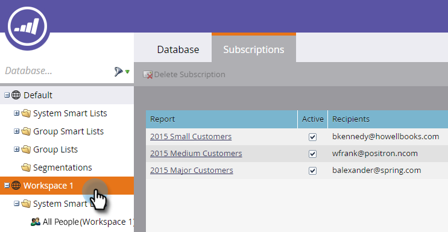

# Assine uma Lista inteligente {#subscribe-to-a-smart-list}

Assinar listas inteligentes é uma excelente maneira de rastrear as pessoas, com relatórios enviados diretamente para sua caixa de entrada.

>[!NOTE]
>
>**FYI**
>
>O Marketo agora está padronizando o idioma em todas as subscrições, portanto você pode ver o lead/lead na sua subscrição e a pessoa/pessoas em docs.marketo.com. Estes termos significam a mesma coisa. isso não afeta as instruções do artigo. Há outras mudanças também. [Saiba mais](http://docs.marketo.com/display/DOCS/Updates+to+Marketo+Terminology).

Você pode criar uma subscrição de lista inteligente em dois locais separados:

* Atividades de marketing
* Banco de dados

O Subscrição usa a lista completa das pessoas no momento em que a subscrição é executada.

O Subscrição vive onde sua lista inteligente está, no Marketing Atividade ou no Banco de Dados.

É possível criar várias subscrições a partir da mesma lista inteligente.

As subscrições são específicas do espaço de trabalho. Por exemplo, essa lista de subscrições está em um espaço de trabalho diferente daquele mostrado no restante deste artigo:

>[!NOTE]
>
>Você está limitado a 100 subscrições e a um máximo de 100.000 pessoas por subscrição, em espaços de trabalho, por instância do Marketo. Se a lista inteligente contiver mais de 100.000 nomes, o Marketo executará a subscrição para os primeiros 100.000.

## Criar uma Subscrição de Lista inteligente {#create-a-smart-list-subscription}

1. Vá para o **Banco de Dados** ou **Atividades** de Marketing.

   

1. Selecione a lista inteligente para a qual deseja criar uma subscrição. Clique em Ações **de** Lista e selecione** Nova Subscrição inteligente**.

   

1. Dê um **nome**&#x200B;à sua subscrição e, em seguida, selecione ou insira os endereços de email dos **Recipient**.

   

1. Clique na lista **Frequency (Frequência** ) e selecione uma frequência.

   ** 

   **

1. Defina a **data final do Delivery **date. Você pode selecionar **Nunca** ou uma data de calendário.

   

1. Clique em **Formatar** e escolha na lista.

   

1. Clique em **Criar**.

   

1. Sua nova subscrição de lista inteligente é exibida na parte superior da lista, na guia Subscrições. Clique em **Enviar** se desejar enviar agora e não aguarde até o delivery de email agendado.

   

1. Recomendamos que você desmarque a caixa de seleção Ativa para desativar uma subscrição de lista inteligente se ninguém se inscrever nela.

   

   Foi fácil, não foi?

## Mensagem de email {#email-message}

Os recipient receberão um email com uma opção para baixar o relatório, bem como um link diretamente para a lista dentro da instância de Marketo. O link de download expira em quatro dias.

>[!NOTE]
>
>Se a configuração Administrador [de Subscrição](secure-the-subscription-admin-setting.md) segura estiver definida como **Sim**, somente as pessoas com acesso à instância de Marketo poderão baixar o relatório.

Se um relatório tiver 0 pessoas, os recipient ainda receberão um email. No entanto, o e-mail simplesmente diz que não há pessoas para relatar.

>[!NOTE]
>
>Quando você modifica um filtro de lista inteligente no qual se baseia uma subscrição, ele também atualiza o relatório.

O email também fornece informações adicionais sobre os filtros usados para criar a lista.

## Excluir uma Subscrição {#delete-a-subscription}

Para excluir uma subscrição, selecione-a na guia subscrições e clique em Excluir Subscrição.

>[!MORELIKETHIS]
>
>* [Editar uma Subscrição de Lista inteligente](edit-a-smart-list-subscription.md)
>* [Proteja a configuração do administrador da Subscrição](secure-the-subscription-admin-setting.md)

>

