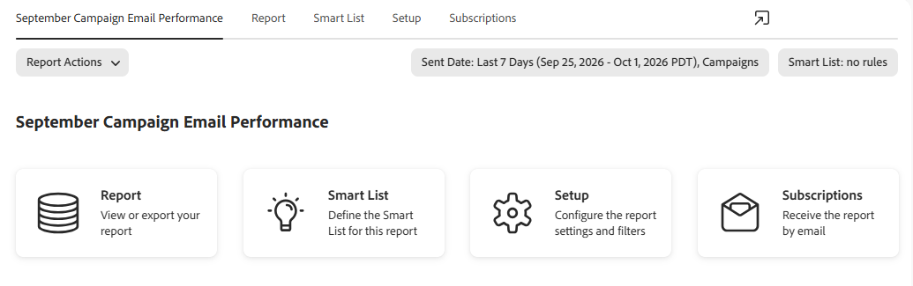

# Relatório de desempenho de email da campanha {#campaign-email-performance-report}

Para ver as estatísticas de desempenho de email agrupadas por [Campanha Inteligente](/help/marketo/product-docs/core-marketo-concepts/smart-campaigns/creating-a-smart-campaign/understanding-batch-and-trigger-smart-campaigns.md), execute um relatório de Desempenho de email da campanha.

>[!NOTE]
>
>Um Relatório de desempenho de email da campanha só pode ser criado como um ativo local em um programa de Atividades de marketing. Não está disponível na seção Analytics.

1. No seu programa, clique em **Novo** e selecione **Novo ativo local**.

   

1. Selecione **Relatório**.

   

1. No menu suspenso _Type_, selecione **Campaign Email Performance**. Dê um nome ao seu relatório e clique em **Criar**.

   

1. Defina os parâmetros do seu relatório.

   

1. Quando terminar, clique na guia **Relatório** para exibir seu relatório.

[As colunas que você pode selecionar](/help/marketo/product-docs/reporting/basic-reporting/editing-reports/select-report-columns.md) para um relatório de Desempenho de email da campanha incluem:

| Coluna | Descrição |
|---|---|
| [!UICONTROL Devolvido(s) Fortemente] | O email foi rejeitado devido a uma condição permanente, como endereço de email inexistente. |
| [!UICONTROL Devolvido(S) Temporariamente] | O email foi rejeitado devido a uma condição temporária, como um servidor inativo ou uma caixa de entrada cheia. |
| [!UICONTROL Pendente] | O email ainda está em processo de entrega. |
| [!UICONTROL Link clicado] | Número de destinatários de email que clicaram em um link no email. |
| [!UICONTROL Cancelamento de assinatura] | Número de destinatários de email que clicaram no link **[!UICONTROL Cancelar inscrição]** no email e preencheram o formulário. |

>[!NOTE]
>
>Em geral, tentamos usar o senso comum para registrar essas estatísticas. Por exemplo, se alguém clicou em um link em um email, obviamente o abriu primeiro. Para obter as regras específicas que seguimos, consulte o [Relatório de Desempenho de Email](/help/marketo/product-docs/email-marketing/email-programs/email-program-data/email-performance-report.md).

>[!MORELIKETHIS]
>
>* [Filtrar Assets em um Relatório de email de campanha](/help/marketo/product-docs/reporting/basic-reporting/report-activity/filter-assets-in-a-campaign-email-reports.md)
>* [Relatório de desempenho de email](/help/marketo/product-docs/email-marketing/email-programs/email-program-data/email-performance-report.md)
