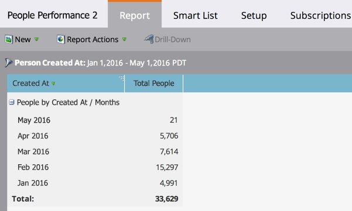

# Relatório de desempenho de pessoas {#people-performance-report}

Use o Relatório de desempenho de Pessoas para medir o crescimento do banco de dados ao longo do tempo. Você pode ver quantas pessoas você adicionou e quando. Saiba mais sobre as pessoas e avalie seus programas. Agrupar os resultados por qualquer pessoa ou atributo da empresa, ou por [segmentação](/help/marketo/product-docs/personalization/segmentation-and-snippets/segmentation/create-a-segmentation.md).

1. [Criar um relatório](/help/marketo/product-docs/reporting/basic-reporting/creating-reports/create-a-report-in-a-program.md) e selecione o **Desempenho de Pessoas** [tipo de relatório](/help/marketo/product-docs/reporting/basic-reporting/report-types/report-type-overview.md).

1. [Definir o período do relatório](/help/marketo/product-docs/reporting/basic-reporting/editing-reports/change-a-report-time-frame.md) e clique no botão **Relatório** guia .

1. Ótimo! Agora você está pronto para explorar seu relatório de Desempenho de pessoas . Saiba mais sobre como obter ainda mais informações na lista abaixo.

   >[!NOTE]
   >
   >Por padrão, os relatórios de Desempenho de pessoas são agrupados por *Criado em* mês.

   

## O poder dos relatórios de desempenho de pessoas {#the-power-of-people-performance-reports}

Os relatórios de desempenho de pessoas são muito poderosos. Ao agrupar, filtrar e configurá-los ainda mais, você pode aprender muito sobre as pessoas no seu banco de dados e sobre a eficácia dos seus programas.

É possível:

* [Agrupar leads por lead ou atributo da empresa](/help/marketo/product-docs/reporting/basic-reporting/report-activity/group-person-reports-by-attribute.md).
* [Agrupar leads por segmento](/help/marketo/product-docs/personalization/segmentation-and-snippets/segmentation/group-person-reports-by-segment.md).
* [Use listas inteligentes como colunas de relatório personalizadas.](/help/marketo/product-docs/reporting/basic-reporting/editing-reports/add-custom-columns-to-a-person-report.md)
* [Adicionar métricas de oportunidade como colunas de relatório.](/help/marketo/product-docs/reporting/basic-reporting/editing-reports/add-opportunity-columns-to-a-lead-report.md)
* [Detalhe para saber mais sobre os leads em uma linha específica.](/help/marketo/product-docs/reporting/basic-reporting/report-activity/drill-down-in-a-people-performance-report.md)
* [Filtre os leads em seu relatório com uma lista inteligente.](/help/marketo/product-docs/reporting/basic-reporting/editing-reports/filter-people-in-a-report-with-a-smart-list.md)
* [Selecione as colunas a serem incluídas.](/help/marketo/product-docs/reporting/basic-reporting/editing-reports/select-report-columns.md)
* [Classifique suas colunas de relatório.](/help/marketo/product-docs/reporting/basic-reporting/editing-reports/sort-report-on-columns.md)

   >[!TIP]
   >
   >Lembre-se de que os relatórios são fáceis de [criar](/help/marketo/product-docs/reporting/basic-reporting/creating-reports/create-a-report-in-a-program.md), configurar e [excluir](/help/marketo/product-docs/reporting/basic-reporting/report-activity/delete-a-report.md). Vá em frente e divirta-se com as muitas maneiras de manipulá-los, para aprender as melhores maneiras de se concentrar em dados importantes.
