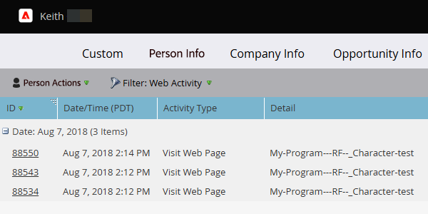

# Páginas da Web Exibidas, Relatório de Atividades da Página da Web {#web-pages-viewed-web-page-activity-report}

Em um [relatório de Atividade da Página da Web](/help/marketo/product-docs/reporting/basic-reporting/report-types/web-page-activity-report.md), você pode ver as páginas específicas que foram visualizadas pelas pessoas no relatório.

>[!PREREQUISITES]
>
>Para capturar a atividade do seu site na Marketo, primeiro é necessário [configurar o Munchkin no seu site](/help/marketo/product-docs/administration/additional-integrations/add-munchkin-tracking-code-to-your-website.md).

1. No seu [Relatório de atividades da página da Web](/help/marketo/product-docs/reporting/basic-reporting/report-types/web-page-activity-report.md), clique no nome da pessoa.

   

1. Uma nova guia é aberta, mostrando a lista de páginas no site que a pessoa visitou e quando.

   

   >[!MORELIKETHIS]
   >
   >Crie um [Relatório de atividade da empresa na Web](/help/marketo/product-docs/reporting/basic-reporting/report-types/company-web-activity-report.md) para ver quais empresas estão visitando seu site.
