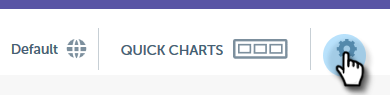

# Dimensões personalizadas para insights de email {#custom-dimensions-for-email-insights}

Todas as dimensões padrão do Marketo estão incluídas, mas você tem a opção de adicionar até 10 dimensões personalizadas. As dimensões personalizadas consistem em segmentações e tags de programa. Veja como adicioná-los.

>[!NOTE]
>
>**Permissões de administrador necessárias**

>[!CAUTION]
>
>As dimensões personalizadas **não podem** ser excluídas ou substituídas, portanto, escolha suas 10 com cuidado.

1. Em [!UICONTROL Insights de email], clique no ícone de engrenagem no canto superior direito da página.

   

1. Clique em **[!UICONTROL Sistema]**.

   

1. Clique no **+** ao lado de **[!UICONTROL Adicionar dimensão]**.

   

1. Comece a selecionar!

   

   >[!NOTE]
   >
   >**[!UICONTROL Por público-alvo]**: exibe todas as segmentações aprovadas (de dentro do banco de dados)
   >
   >**[!UICONTROL Por Conteúdo]**: Exibe todas as Marcas do Programa
