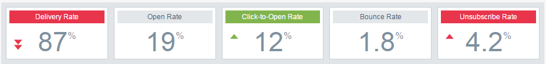

# Visão geral do Email Insights Analytics {#email-insights-analytics-overview}

No [!UICONTROL Analytics], explore dados agregados para entrega de email e participação. Use o gráfico à esquerda para explorar dados, os insights à direita para obter uma experiência mais guiada.

A [Filtragem](/help/marketo/product-docs/reporting/email-insights/filtering-in-email-insights.md) está disponível para ajudá-lo a detalhar métricas específicas.

Os blocos de Principais pontos de interesse (KPI) fornecem uma olhada rápida nas métricas mais populares.

Passe o mouse sobre os blocos de KPI para obter detalhes...

...ou ver detalhes sem precisar passar o mouse, expandindo a janela do navegador (em telas maiores).

>[!TIP]
>
>Essas cores significam alguma coisa! Verde indica uma boa mudança, vermelho significa uma má mudança, cinza significa que nada mudou. Isso se baseia no período de comparação escolhido na filtragem.

O gráfico exibe os critérios filtrados. Para ocultar um dos filtros, basta clicar na barra de cores...

... e a métrica desaparecerá do gráfico. Clique na barra de cores novamente para que ela reapareça.

Se você criar um gráfico que gostaria de usar novamente, torne-o um [gráfico rápido](/help/marketo/product-docs/reporting/email-insights/email-insights-quick-charts.md).

No lado direito da página, as métricas guiadas ajudam a descobrir drivers relevantes. Clique em qualquer métrica para vê-la no gráfico no lado esquerdo da página.

>[!NOTE]
>
>Você está vendo que [!UICONTROL Atualizar] no canto superior direito? Ao visualizá-lo, será necessário clicar manualmente nele para atualizar o módulo Insights. Só a mostramos quando você tiver feito uma alteração nos filtros que invalidariam os valores atuais.

Você também pode especificar o que vê (da esquerda para a direita): Tudo, Público-alvo, Conteúdo e Plataforma.

>[!MORELIKETHIS]
>
>[Visão Geral De Envios De Insights De Email](/help/marketo/product-docs/reporting/email-insights/email-insights-sends-overview.md)
