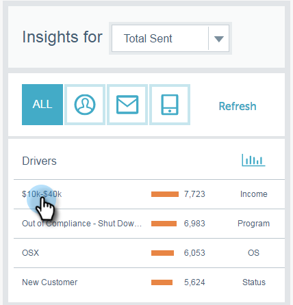

# Visão geral da análise de insights de email {#email-insights-analytics-overview}

No Analytics, explore dados agregados para entrega e envolvimento de emails. Use o gráfico à esquerda para explorar dados, os insights à direita para uma experiência mais guiada.

[Filtragem](/help/marketo/product-docs/reporting/email-insights/filtering-in-email-insights.md) O está disponível para ajudar você a fazer busca detalhada de métricas específicas.

Os blocos de Pontos principais de interesse (KPI) fornecem uma visão rápida das métricas mais populares.

Passe o mouse sobre os blocos KPI para obter detalhes..

...ou veja os detalhes sem precisar passar o mouse expandindo sua janela do navegador (em telas maiores).

>[!TIP]
>
>Essas cores significam algo! Verde indica uma boa mudança, vermelho significa uma mudança ruim, cinza significa que nada mudou. Isso se baseia no período de comparação escolhido na filtragem.

O gráfico exibe seus critérios filtrados. Para ocultar um dos filtros, basta clicar na barra de cores...

...e a métrica desaparece do gráfico. Clique na barra de cores novamente para fazê-la reaparecer.

Se você criar um gráfico que gostaria de usar novamente, torne-o um [gráfico rápido](/help/marketo/product-docs/reporting/email-insights/email-insights-quick-charts.md).

No lado direito da página, as métricas guiadas ajudam você a descobrir drivers relevantes. Clique em qualquer métrica para vê-la no gráfico no lado esquerdo da página.

>[!NOTE]
>
>Vê aquele item Refresh no canto superior direito? Ao visualizá-lo, será necessário clicar manualmente nele para atualizar o módulo Insights. Somente mostramos isso quando você faz uma alteração em filtros que invalidariam os valores atuais.

Também é possível especificar o que você vê (da esquerda para a direita): Tudo, público-alvo, conteúdo e plataforma.

>[!MORELIKETHIS]
>
>[Visão geral dos envios de insights de email](/help/marketo/product-docs/reporting/email-insights/email-insights-sends-overview.md)
