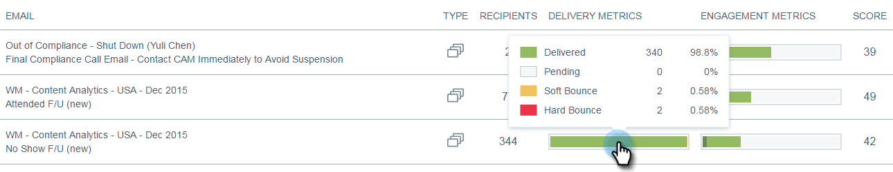

# Visão geral dos insights de email {#email-insights-overview}

Os Insights de email fornecem insights avançados dos dados históricos dos profissionais de marketing de email. Ele consiste em duas seções separadas, mas associadas: Analytics e envios.

Para acessar o Email Insights, basta clicar no respectivo bloco em Meu Marketo (ou na tela inicial do Analytics).

>[!NOTE]
>
>Por padrão, você verá dados para cada espaço de trabalho ao qual tem acesso. Você pode desmarcar os espaços de trabalho que não deseja visualizar. Sua(s) seleção(ões) será(ão) lembrada(s) a partir de agora.

## Análises {#analytics}

Use [Analytics](/help/marketo/product-docs/reporting/email-insights/email-insights-analytics-overview.md) para explorar os dados agregados das séries de tempo para delivery de email e métricas de envolvimento.

**Filtros**

Usado avançado [filtros](/help/marketo/product-docs/reporting/email-insights/filtering-in-email-insights.md) para analisar os resultados por público-alvo, conteúdo ou plataforma. Os mesmos filtros se aplicam ao Analytics e aos Envios.

**Gráficos rápidos**

[Gráficos rápidos](/help/marketo/product-docs/reporting/email-insights/email-insights-quick-charts.md) são miniaturas criadas e salvas, fornecendo uma visualização rápida dos gráficos importantes para você.

## Envios {#sends}

No [Envia](/help/marketo/product-docs/reporting/email-insights/email-insights-sends-overview.md) examine as características da comunicação por email recente.

**Métricas**

Clique nas barras Métricas para traduzir as cores em números.

>[!NOTE]
>
>Pode levar até 8 horas para que os dados sejam refletidos nos Insights de email.

## Dimension personalizados {#custom-dimensions}

Todas as dimensões padrão do Marketo são incluídas, mas você tem a opção de adicionar até 10 dimensões personalizadas. [Dimensões personalizadas](/help/marketo/product-docs/reporting/email-insights/custom-dimensions-for-email-insights.md) consistem em segmentações e tags de programa.

>[!MORELIKETHIS]
>
>* [Visão geral da análise de insights de email](/help/marketo/product-docs/reporting/email-insights/email-insights-analytics-overview.md)
>* [Visão geral dos envios de insights de email](/help/marketo/product-docs/reporting/email-insights/email-insights-sends-overview.md)

