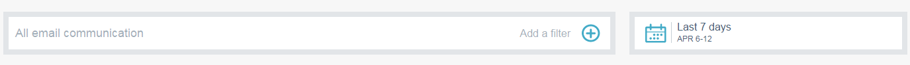

# Visão geral de envios de insights de email {#email-insights-sends-overview}

Na página [!UICONTROL Envios], examine as características das comunicações recentes por email.

Use [filtragem](/help/marketo/product-docs/reporting/email-insights/filtering-in-email-insights.md) para especificar quais emails você deseja ver.

No lado direito da página há várias informações sobre os emails enviados.

**[!UICONTROL Type]** indica o tipo de ativo usado.
O número de **[!UICONTROL Destinatário]** é a quantidade de pessoas que receberam o email.
**[!UICONTROL Métricas de Entrega]** fornece uma visão rápida de quantos emails foram entregues, estão pendentes ou foram rejeitados.
**[!UICONTROL Métricas de engajamento]** oferece uma visão rápida de quantos destinatários abriram, clicaram e cancelaram a assinatura de um email.
**[!UICONTROL Pontuação]** é a [Pontuação de engajamento](/help/marketo/product-docs/email-marketing/drip-nurturing/reports-and-notifications/understanding-the-engagement-score.md) do seu email.

Por padrão, seus emails são classificados pelos mais recentes, mas você pode classificá-los por qualquer métrica disponível.

>[!NOTE]
>
>Os emails são listados por nome de programa ou campanha (parte superior) e nome de ativo de email (parte inferior).

Se quiser exibir as estatísticas de seu email no Analytics, passe o mouse ao lado de Pontuação e clique no ícone do gráfico.

Coisa legal!

>[!MORELIKETHIS]
>
>[Visão geral do Email Insights Analytics](/help/marketo/product-docs/reporting/email-insights/email-insights-analytics-overview.md)
