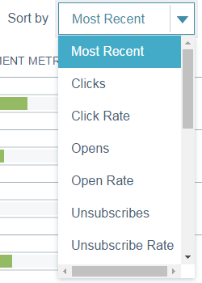

# Visão geral dos envios de insights de email {#email-insights-sends-overview}

Na página Envios , examine as características da comunicação por email recente.

Use [filtragem](/help/marketo/product-docs/reporting/email-insights/filtering-in-email-insights.md) para especificar quais emails deseja ver.

No lado direito da página, há várias informações relacionadas aos emails enviados.

**Tipo** indica o tipo de ativo usado.
**Recipient** número é quantas pessoas receberam o email.
**Métricas de entrega** O fornece uma visualização rápida de quantos emails foram entregues, estão pendentes ou retornaram.\
**Métricas de envolvimento** fornece uma visualização rápida de quantos recipients abriram, clicaram e cancelaram a assinatura de um email.
**Pontuação** é o seu email [Pontuação de engajamento](/help/marketo/product-docs/email-marketing/drip-nurturing/reports-and-notifications/understanding-the-engagement-score.md).

Por padrão, seus emails são classificados pelo mais recente, mas você pode classificá-los por qualquer métrica disponível.

>[!NOTE]
>
>Os emails são listados por nome do programa ou da campanha (parte superior) e nome do ativo de email (parte inferior).

Se desejar visualizar as estatísticas do email no Analytics, passe o mouse ao lado de Score e clique no ícone do gráfico.

Coisa legal!

>[!MORELIKETHIS]
>
>[Visão geral da análise de insights de email](/help/marketo/product-docs/reporting/email-insights/email-insights-analytics-overview.md)
