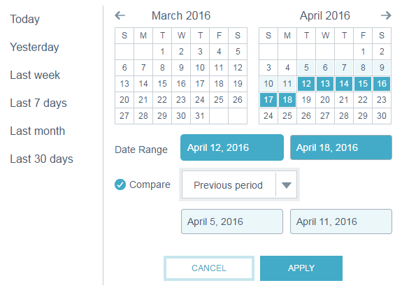

# Filtragem em [!UICONTROL Insights de email] {#filtering-in-email-insights}

Em [!UICONTROL Insights de email], há diferentes maneiras de filtrar seus dados.

## [!UICONTROL Email Insights] {#email-insights}

Clique em + para começar a adicionar filtros. Adicione quantos desejar.

Se você tiver mais de um filtro na mesma categoria, eles serão mesclados e exibirão a quantidade.

Se precisar ver quais filtros você aplicou, basta clicar no filtro. Você pode até adicionar mais lá.

Você também pode adicionar outros tipos de filtros.

E ainda mais filtros!

O gráfico muda após a aplicação de cada filtro.

Para excluir uma categoria, clique no X correspondente.

Para limpar todos os filtros, clique no X ao final da barra de filtros.

Para dados específicos de data, use intervalos de datas.

Escolha entre intervalos de datas predefinidos comuns, selecione datas específicas e use o período anterior para comparação.

>[!NOTE]
>
>Os intervalos de datas se aplicam às páginas [!UICONTROL Analytics] e [!UICONTROL Sends]. No entanto, a opção **Comparar** só se aplica à página [!UICONTROL Analytics].

## Marketing baseado em conta {#account-based-marketing}

Se você usa o [[!UICONTROL Target Account Management]](https://docs.marketo.com/display/DOCS/Account+Based+Marketing+Overview), há filtros específicos para você.

