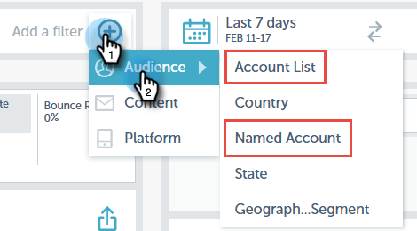

# Filtragem em insights de email {#filtering-in-email-insights}

No Email Insights, há diferentes maneiras de filtrar seus dados.

## Email Insights {#email-insights}

Clique em + para começar a adicionar filtros. Adicione quantos quiser.

Se você tiver mais de um filtro na mesma categoria, eles mesclarão e exibirão a quantidade.

Se precisar ver quais filtros você aplicou, basta clicar no filtro. Você pode até adicionar mais lá.

Você também pode adicionar outros tipos de filtros.

E ainda mais filtros!

O gráfico muda após a aplicação de cada filtro.

Para excluir uma categoria, clique no X.

Para limpar todos os filtros, clique no X no final da barra de filtros.

Para dados específicos de data, use intervalos de datas.

Escolha entre intervalos de datas predefinidos comuns, selecione datas específicas, mesmo use o período anterior para comparação.

>[!NOTE]
>
>Os intervalos de datas se aplicam à página do Analytics e às páginas Envios . O **Comparar** no entanto, essa opção só é aplicável à página do Analytics.

## Marketing baseado em conta {#account-based-marketing}

Se você usar [Gerenciamento de conta do Target](https://docs.marketo.com/display/DOCS/Account+Based+Marketing+Overview), há filtros especificamente para você.

