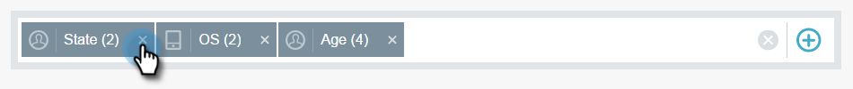

# Filtragem em insights de email {#filtering-in-email-insights}

No Email Insights, há diferentes maneiras de filtrar seus dados.

## Insights de email {#email-insights}

Clique no sinal + para adicionar filtros ao start. Adicione quantos quiser.

Se você tiver mais de um filtro na mesma categoria, ele irá mesclar e exibir a quantidade.

Se precisar ver quais filtros você aplicou, basta clicar no filtro. Você pode até adicionar mais lá.

Você também pode adicionar outros tipos de filtros.

E ainda mais filtros!

O gráfico muda depois que cada filtro é aplicado.

Para excluir uma categoria, clique em seu X.

Para limpar todos os filtros, clique no X no final da barra de filtro.

Para dados específicos de data, use intervalos de datas.

Escolha entre intervalos de datas predefinidos comuns, selecione datas específicas, até mesmo use o período anterior para comparação.

>[!NOTE]
>
>Os intervalos de datas se aplicam à página Análises e à página Envios. Entretanto, a opção **Comparar** só se aplica à página do Analytics.

## Marketing baseado em conta {#account-based-marketing}

Se você usar o Marketing [baseado em](http://docs.marketo.com/display/DOCS/Account+Based+Marketing+Overview)conta, há filtros específicos para você.

