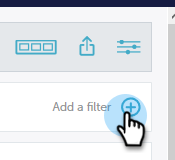

# Filtragem em [!UICONTROL Insights de Desempenho] {#filtering-in-performance-insights}

Filtre dados com facilidade para consultar informações específicas.

Clique em + para começar a adicionar filtros.

>[!NOTE]
>
>No momento, os Atributos personalizados estão disponíveis em filtros somente para clientes que têm o Revenue Cycle Analytics ativado.

Clicar em uma categoria revela várias subcategorias.

Escolha uma subcategoria e procure/selecione um valor.

Os gráficos são atualizados para refletir os filtros selecionados.

Você pode adicionar filtros extras seguindo as mesmas etapas.

Você pode remover um filtro a qualquer momento clicando no X ao lado dele. Remova todos os filtros de uma só vez clicando no X à direita.

## Filtros disponíveis {#available-filters}

<table> 
 <tbody> 
  <tr> 
   <td colspan="1"><strong>Lista de contas ABM</strong></td> 
   <td colspan="1">Se você estiver usando o Marketo ABM, todas as suas listas de contas serão sincronizadas com o MPI e estarão visíveis por meio do filtro ‘Lista de contas do ABM’. Você pode selecionar uma lista de contas para filtrar os resultados para essas contas.<a href="https://docs.marketo.com/display/public/DOCS/Account-Based+Web+Marketing+with+ABM" rel="nofollow">Saiba mais sobre as listas de contas ABM.</a></td> 
  </tr> 
  <tr> 
   <td colspan="1"><strong>Conta nomeada ABM</strong></td> 
   <td colspan="1">Se você estiver usando o Marketo ABM, todas as suas contas nomeadas serão sincronizadas com o MPI e estarão visíveis por meio do filtro ‘Conta nomeada ABM’. Você pode selecionar uma conta nomeada para filtrar os resultados para essas contas.<a href="https://docs.marketo.com/x/eaCt" rel="nofollow">Saiba mais sobre contas nomeadas ABM.</a></td> 
  </tr> 
  <tr> 
   <td colspan="1"><strong>Atributo personalizado</strong></td> 
   <td colspan="1">
Estes são determinados por você. Todos os campos <a href="/help/marketo/product-docs/reporting/revenue-cycle-analytics/revenue-tools/enabling-custom-field-sync-for-revenue-cycle-analytics.md" rel="nofollow">que você habilitar</a> para a análise de oportunidade podem ser filtrados em Performance Insights.
</td> 
  </tr> 
  <tr> 
   <td colspan="1">
<strong>Período de investimento</strong>
</td> 
   <td colspan="1">
Período de tempo do custo do programa.
</td> 
  </tr> 
  <tr> 
   <td colspan="1">
<strong>Oportunidade</strong>
</td> 
   <td colspan="1">
Tipo de oportunidade conforme configurado no objeto Oportunidade da configuração do Salesforce (CRM).
</td> 
  </tr> 
  <tr> 
   <td>
<strong>Marca de programa</strong>
</td> 
   <td>
As tags são usadas para descrever programas. Você pode criar quantos forem necessários, cada um com valores únicos. <a href="/help/marketo/product-docs/administration/tags/create-a-new-program-tag-and-tag-values.md" rel="nofollow">Saiba como trabalhar com marcas de programa aqui.</a>
</td> 
  </tr> 
  <tr> 
   <td><strong>Espaço de trabalho</strong></td> 
   <td>
Os espaços de trabalho são áreas separadas no Marketo que contêm ativos de marketing, como: programas, landing pages, emails e muito mais. <a href="/help/marketo/product-docs/administration/workspaces-and-person-partitions/understanding-workspaces-and-person-partitions.md" rel="nofollow">Saiba mais sobre os espaços de trabalho aqui.</a>
</td> 
  </tr> 
 </tbody> 
</table>

>[!NOTE]
>
>No painel [!UICONTROL Envolvimento], somente as marcas do programa e os filtros do espaço de trabalho estão disponíveis.
