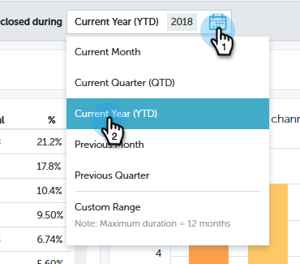

# Visão geral da contribuição dos Insights {#performance-insights-contribution-overview}

No Marketo Performance Insights, a exibição Contribuição é exibida por padrão.

Selecione a métrica para a qual deseja visualizar o desempenho. Neste exemplo, vamos examinar as oportunidades ganhas por meio de Multitoque no painel Receita.

>[!NOTE]
>
>Saiba mais sobre [Primeiro toque e multitoque](/help/marketo/product-docs/reporting/revenue-cycle-analytics/revenue-tools/attribution/understanding-attribution.md).

Escolha o período em que deseja visualizar as métricas. Neste exemplo, estamos olhando para o ano atual (acumulado do ano).

>[!NOTE]
>
>Removemos temporariamente a seleção do &quot;Ano anterior&quot;. Você ainda tem a opção de visualizar todos os dados de desempenho do ano anterior usando a seleção de Intervalo personalizado .

As métricas são apresentadas por meio de dois gráficos: donut e bar.

O gráfico de rosca mostra os dez principais canais para a métrica selecionada.

O gráfico de barras exibe o desempenho do programa em todos os canais (dez programas por vez) para a métrica selecionada. Para ver mais, clique na seta à direita para rolar até o próximo grupo.

>[!TIP]
>
>Se desejar que as barras no gráfico sejam ampliadas à medida que você rolar pelos grupos, selecione a opção **Dimensionar eixo Y para ajustar** caixa de seleção.

Passe o mouse sobre uma barra para ver detalhes adicionais.

Selecione um ou mais canais no gráfico de rosca e todos os programas associados a esses canais serão exibidos no gráfico de barras à direita. Clique nos canais novamente para desmarcar.

A grade de dados abaixo funciona como uma planilha, mostrando todas as métricas disponíveis no modelo de atribuição escolhido (Primeiro toque/multitoque). A coluna contendo a métrica escolhida é realçada.

| **Oportunidades conquistadas** | A parte do crédito (em valor numérico) que o programa recebeu por influenciar a oportunidade vencedora |
|---|---|
| **Receita conquistada** | Parte do crédito (em valor monetário) que o programa recebeu por influenciar a oportunidade vencedora |
| **Custo** | Custo total do programa |
| **Custo por oportunidade conquistada** | A relação entre o custo do programa e a parte do crédito (em valor numérico) que o programa recebeu por influenciar a criação de novas oportunidades |
| **Taxa de Ganho a Receita em Custo** | O rácio da parte do crédito (em valor monetário) que o programa recebeu para influenciar oportunidades vencidas e o custo do programa |

Expanda um canal para ver seus dez programas principais, com os restantes programas combinados.

>[!NOTE]
>
>Clicar na caixa de seleção ao lado de um canal a ativa/desativa no gráfico de rosca acima.
