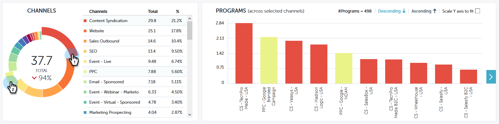

# Visão geral da contribuição do Performance Insights {#performance-insights-contribution-overview}

No Marketo Performance Insights, a visualização Contribuição é exibida por padrão.

Selecione a métrica para exibir o desempenho. Neste exemplo, analisaremos as oportunidades ganhas por meio do recurso Multitoque no painel Receita.

>[!NOTE]
>
>Saiba mais sobre [Primeiro contato e multitoque](/help/marketo/product-docs/reporting/revenue-cycle-analytics/revenue-tools/attribution/understanding-attribution.md).

Escolha para qual período você gostaria de ver as métricas. Neste exemplo, estamos observando o ano atual (acumulado no ano).

>[!NOTE]
>
>Removemos temporariamente a seleção &quot;Ano anterior&quot;. Você ainda tem a opção de visualizar os dados de desempenho do ano anterior usando a seleção Intervalo personalizado.

As métricas são apresentadas por meio de dois gráficos: rosca e barra.

O gráfico de rosca mostra os dez principais canais para a métrica selecionada.

O gráfico de barras exibe o desempenho do programa em todos os canais (dez programas de cada vez) para a métrica selecionada. Para ver mais, clique na seta à direita para rolar até o próximo grupo.

>[!TIP]
>
>Se desejar que as barras no gráfico sejam dimensionadas à medida que você rolar pelos grupos, marque a caixa de seleção **Dimensionar eixo Y para ajustar**.

Passe o mouse sobre uma barra para ver mais detalhes.

Selecione um ou mais canais no gráfico de rosca e todos os programas associados a esses canais aparecerão no gráfico de barras à direita. Clique no(s) canal(is) novamente para desmarcar.

A grade de dados abaixo funciona como uma planilha, mostrando todas as métricas disponíveis no modelo de atribuição escolhido (Primeiro toque/Multitoque). A coluna que contém a métrica escolhida é realçada.

| **Oportunidades Ganhadas** | A parte do crédito (em valor numérico) que o programa recebeu por influenciar a oportunidade conquistada |
|---|---|
| **Receita Ganha** | A parte do crédito (em valor monetário) que o programa recebeu por influenciar a oportunidade conquistada |
| **Custo** | Custo total do programa |
| **Custo por oportunidade conquistada** | A proporção do custo do programa e a parte do crédito (em valor numérico) que o programa recebeu por influenciar a criação de novas oportunidades |
| **Taxa De Receitas Ganhas Por Custo** | A proporção da parte do crédito (em valor monetário) que o programa recebeu por influenciar as oportunidades conquistadas e o custo do programa |

Expanda um canal para ver seus dez principais programas, com os programas restantes combinados.

>[!NOTE]
>
>Clicar na caixa de seleção ao lado de um canal o ativa/desativa no gráfico de rosca acima.
