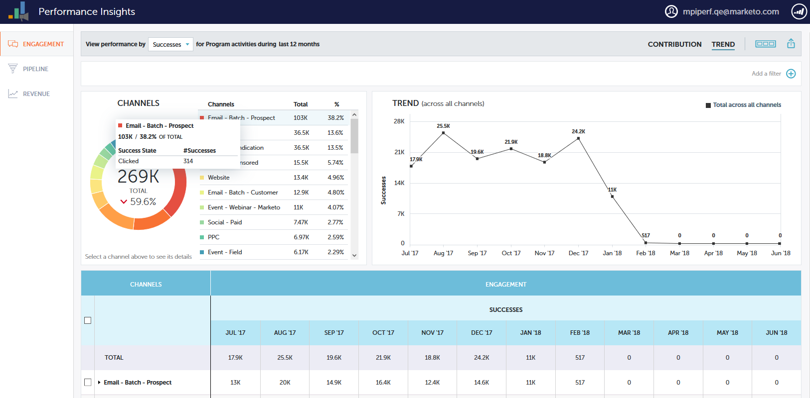

# Visão geral do Performance Insights {#performance-insights-overview}

O Marketing Performance Insights ajuda você a otimizar sua combinação de canais para obter a máxima eficácia, bem como descobrir tendências de longo prazo para descobrir estratégias vencedoras consistentes.

>[!NOTE]
>
>**Disponibilidade**
>
>Nem todos os clientes têm o recurso Performance Insights. Entre em contato com o Gerente de sucesso do cliente para obter mais informações.

O Performance Insights carrega dados dos (até) 24 meses anteriores. Isso inclui os dados atuais do ano, bem como os do ano anterior. Por exemplo, em 31 de janeiro de 2019, o MPI carregará dados daquele mês, e a cada mês a partir de 2018. Em 31 de dezembro de 2019, a MPI carregará dados de cada mês de 2019 e 2018.

Para acessar o Performance Insights, clique em seu ícone na tela inicial do Analytics.

## Contribuição {#contribution}

Avalie a contribuição [da Marketing para a receita](http://docs.marketo.com/x/QAvG)em função da aquisição, influência, conversão, até mesmo do crescimento básico instalado pelo cliente.

Por padrão, os dados exibidos refletem o desempenho por Envolvimento. Você pode alternar para o desempenho por Pipeline ou Revenue simplesmente clicando em um deles.

## Tendência {#trend}

Descubra as [tendências de longo prazo](http://docs.marketo.com/x/QgvG) para descobrir estratégias vencedoras consistentes.

## Configurações {#settings}

Nos painéis de Receita e Pipeline, clique no ícone [Configurações](http://docs.marketo.com/x/pIDS) para definir parâmetros adicionais.

## Exportar dados {#export-data}

Você pode exportar os dados e gráficos no PowerPoint ou no Excel. Você também pode salvá-los como um [Gráfico rápido](https://docs.marketo.com/x/iRLG).

>[!NOTE]
>
>Exporte dados para o Excel para ver os dados disponíveis para todos os canais (não apenas os dez primeiros). A exportação de PPT será WYSIWYG (a saída imitará o que você vê na tela).

