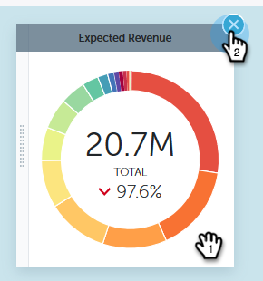
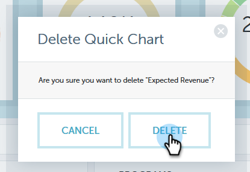

# [!UICONTROL Insights de Desempenho] [!UICONTROL Gráficos Rápidos] {#performance-insights-quick-charts}

[!UICONTROL Gráficos Rápidos] são miniaturas que você personaliza e salva, fornecendo uma visualização rápida dos gráficos que você mais usa.

## Criar um Novo Gráfico Rápido {#create-a-new-quick-chart}

[!UICONTROL Gráficos rápidos] derivados dos dados especificados. Neste exemplo, vamos escolher: **novas oportunidades (primeiro contato), tipo de oportunidade = novos negócios, acumulado no ano atual**.

1. Clique no filtro de datas e escolha **[!UICONTROL Ano Atual (YTD)]**.

   

1. Clique em **+** e selecione seus critérios.

   

1. O gráfico é atualizado para refletir os filtros escolhidos.

   

1. Clique no ícone Exportar e selecione **[!UICONTROL Salvar como Gráfico Rápido]**.

   

1. Nomeie o Gráfico rápido e clique em **[!UICONTROL Salvar]**.

   

O Gráfico rápido agora está com os outros.

>[!NOTE]
>
>Você pode ter até 20 Gráficos Rápidos. Elas podem ser excluídas e substituídas.

## Exibir Gráficos Rápidos Existentes {#view-existing-quick-charts}

1. Para exibir seus Gráficos Rápidos existentes, basta clicar no ícone **[!UICONTROL Gráficos Rápidos]**.

   

## Excluir um Gráfico Rápido {#delete-a-quick-chart}

Se precisar excluir um Gráfico Rápido, siga estas etapas simples.

1. Clique no ícone **[!UICONTROL Gráficos rápidos]**.

   

1. Passe o mouse sobre o gráfico desejado, mas não clique nele. Ao passar o cursor do mouse, um X será exibido. Clique no **X**.

   

1. Clique em **[!UICONTROL Excluir]**.

   
