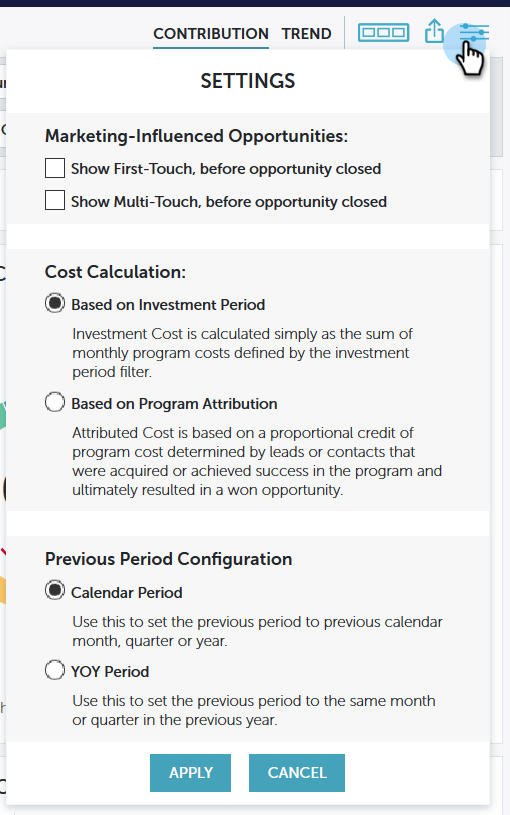

# Configurações do Performance Insights {#performance-insights-settings}

Saiba mais sobre as diferentes opções de Configurações em MPI.

>[!NOTE]
>
>Dependendo do painel em que você está, você verá diferentes opções de configuração.

## Programa de visualização bem-sucedido por {#view-program-success-by}

**Painel de envolvimento - contribuição e tendência**

| **Período de Custo** | Ao verificar isso, o Performance Insights fará a agregação de todos os novos nomes e sucessos de volta ao mês configurado como o período de custo. |
|---|---|
| **Período de atividade** | Ao verificar isso, o Performance Insights agregação todos os novos nomes, sucessos e associação por data de atividade, independentemente do período de custo do programa. |

## Configuração do período anterior {#previous-period-configuration}

**Envolvimento, Pipeline, Painéis de receita - Apenas contribuição**

| **Período do calendário** | Defina o período anterior como: mês, trimestre ou ano civil anterior. |
|---|---|
| **Período YOY** | Defina o período anterior para o mesmo mês ou trimestre do ano anterior. |

## Oportunidades influenciadas pelo marketing {#marketing-influenced-opportunities}

**Painel de pipeline - Contribuição e tendência**

<table> 
 <tbody> 
  <tr> 
   <td><strong>Mostrar primeiro toque, antes da criação da oportunidade</strong></td> 
   <td>
Ao verificar isso, o MPI inclui oportunidades associadas a pelo menos um cliente potencial adquirido (primeiro toque/FT) por um Programa de marketing antes da criação da oportunidade. As configurações de atribuição Explícita, implícita e híbrida são aplicáveis.
</td> 
  </tr> 
  <tr> 
   <td><strong>Mostrar multitoque, antes da criação da oportunidade</strong></td> 
   <td>
Ao verificar isso, o MPI inclui oportunidades com pelo menos um cliente potencial adquirido (multi-touch/MT) por um Programa de marketing antes da criação da oportunidade. As configurações de atribuição Explícita, implícita e híbrida são aplicáveis.
</td> 
  </tr> 
 </tbody> 
</table>

Painel de receita - Contribuição e tendência

<table> 
 <tbody> 
  <tr> 
   <td><strong>Mostrar primeiro toque, antes que a oportunidade seja fechada</strong></td> 
   <td>
Ao verificar isso, o MPI inclui oportunidades associadas a pelo menos um cliente potencial adquirido (primeiro toque/FT) por um Programa de marketing antes do encerramento da oportunidade. As configurações de atribuição Explícita, implícita e híbrida são aplicáveis.
</td> 
  </tr> 
  <tr> 
   <td><strong>Mostrar multitoque, antes que a oportunidade seja fechada</strong></td> 
   <td>
Quando você verifica isso, o MPI inclui oportunidades com pelo menos um cliente potencial adquirido (multi-touch/MT) por um Programa de marketing antes de a oportunidade ser fechada. As configurações de atribuição Explícita, implícita e híbrida são aplicáveis.
</td> 
  </tr> 
 </tbody> 
</table>

## Cálculo de custo {#cost-calculation}

**Pipeline e Painéis de receita - Contribuição e tendência**

| **Com base no período de investimento** | O Custo de Investimento é calculado simplesmente como a soma dos custos de programa mensais definidos pelo filtro do período de investimento. |
|---|---|
| **Com base na atribuição do Programa** | O Custo Atribuído é baseado em uma porção do custo do programa determinado por clientes potenciais ou contatos que foram adquiridos, ou alcançaram sucesso, no programa e acabaram resultando em uma oportunidade vencida. |

