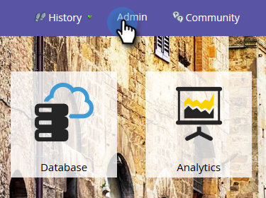
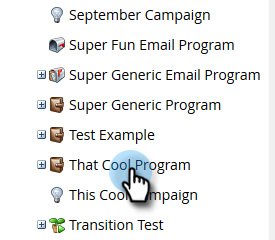

# Configuração de insights de desempenho {#setting-up-performance-insights}

Siga as etapas abaixo para configurar a MPI.

## Configuração da oportunidade {#opportunity-setup}

1. Clique em **Administrador**.

   

1. Clique em **Análise do ciclo de receita**.

   

   >[!NOTE]
   >
   >Se você não tiver a RCA, precisará selecionar **Análise de programa** para a Etapa 2.

1. Em Atribuição, clique em **Editar**.

   

1. Configurações de atribuição são exibidas.

   

   Se a Atribuição for explícita, verifique se a Função de contato da oportunidade foi preenchida (por meio do endpoint da Função da oportunidade ou pela integração do CRM).

   Se a Atribuição estiver implícita, verifique se o campo da empresa no cliente potencial/contato é igual ao Nome da conta da oportunidade.

   >[!NOTE]
   >
   >Certifique-se de que todas as oportunidades tenham os campos apropriados preenchidos:
   >
   >* Valor da oportunidade
   >* Está fechado
   >* É obtido
   >* Data de criação (não pode ser definida no seu caso)
   >* Data de fechamento (não pode ser definida no seu caso)
   >* Tipo de oportunidade

## Configuração de programa {#program-setup}

Atualizar os custos do programa por, pelo menos, 12 meses. Você pode fazer isso manualmente ou usando a API do programa. Neste exemplo, fazemos isso manualmente.

1. Clique em **Atividades de marketing**.

   

1. Localize e selecione seu programa.

   

1. Clique na guia **Configuração**.

   

1. Arraste **Custo do Período** para a tela.

   

1. Defina o Mês do Programa para pelo menos 12 meses atrás e clique em **Ok**.

   

1. Defina o custo do período e clique em **Salvar**.

   

Em seguida, revise o comportamento do Analytics para indicar se um canal específico deve ser incluído no Analytics. Defina o comportamento do Analytics (Normal, Inclusivo, Operacional).

1. Clique em **Administrador**.

   

1. Clique em **Marcas**.

   

1. Clique em **+** para expandir a lista Canal.

   

1. Clique duas vezes no canal desejado.

   

1. Clique no menu suspenso **Comportamento do Analytics** e selecione o comportamento desejado.

   

1. Defina os critérios de sucesso.

   

1. Clique em **Salvar**.

   

## Vincular o programa à pessoa {#tie-the-program-to-the-person}

1. Verifique se o Programa de aquisição e a Data de aquisição foram definidos para cada pessoa no banco de dados para que a Atribuição de primeiro contato funcione.
1. Certifique-se de que seus programas estejam definindo estados de sucesso para sua equipe.

>[!NOTE]
>
>As alterações feitas não são instantâneas. É necessário um período noturno antes de as alterações entrarem em vigor.
