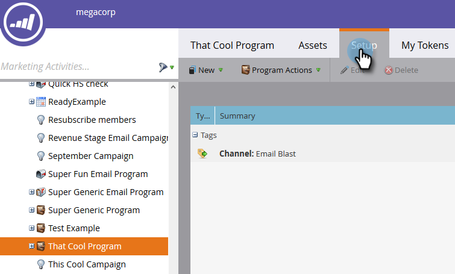

# Configurando Insights de Desempenho {#setting-up-performance-insights}

Siga as etapas abaixo para configurar a MPI.

## Configuração da Oportunidade {#opportunity-setup}

1. Clique em **Admin**.

   

1. Clique em **Análises do ciclo de receita**.

   

   >[!NOTE]
   >
   >Se você não tiver RCA, será necessário selecionar **Análise do Programa** para a Etapa 2.

1. Em Atribuição, clique em **Editar**.

   

1. Configurações de atribuição são exibidas.

   

   Se a Atribuição for explícita, verifique se a Função de Contato da Oportunidade foi preenchida (por meio do endpoint de Função da Oportunidade ou por meio da integração do CRM).

   Se a Atribuição estiver implícita, verifique se o campo empresa no cliente potencial/contato é igual ao Nome da conta da oportunidade.

   >[!NOTE]
   >
   >Verifique se todas as oportunidades têm os campos apropriados preenchidos:
   >
   >    
   >    
   >    * Valor da Oportunidade
   >    * Está fechado
   >    * É vencido
   >    * Data de criação (isso pode não ser definido no seu caso)
   >    * Data de Fechamento (isso pode não ser definido no seu caso)
   >    * Tipo de oportunidade

## Configuração do programa {#program-setup}

Atualize os custos do programa por pelo menos 12 meses. É possível fazer isso manualmente ou usando a API do programa. Neste exemplo fazemos manualmente.

1. Clique em **Atividades de marketing**.

   

1. Localize e selecione seu programa.

   

1. Clique na guia **Configuração**.

   

1. Arraste **Custo do Período** para a tela.

   

1. Defina o Mês do Programa há pelo menos 12 meses e clique em **Ok**.

   

1. Defina o custo do período e clique em **Salvar**.

   

Em seguida, analise o comportamento do Analytics para indicar se um canal específico deve ser incluído no Analytics. Defina o comportamento do Analytics (Normal, Inclusivo, Operacional).

1. Clique em **Admin**.

   

1. Clique em **Tags**.

   

1. Clique em **+** para expandir a lista do Canal.

   

1. Clique com o duplo no canal desejado.

   

1. Clique na lista suspensa **Comportamento do Analytics** e selecione o comportamento desejado.

   

1. Defina os critérios de sucesso.

   

1. Clique em **Salvar**.

   

## Vincule o Programa à Pessoa {#tie-the-program-to-the-person}

1. Verifique se o Programa de aquisição e a Data de aquisição foram definidos para cada pessoa no banco de dados para que a Atribuição de primeiro contato funcione.
1. Certifique-se de que seus programas estejam configurando estados de sucesso para suas pessoas.

>[!NOTE]
>
>As alterações efetuadas não são instantâneas. É necessário um período overnight antes de as alterações entrarem em vigor.

