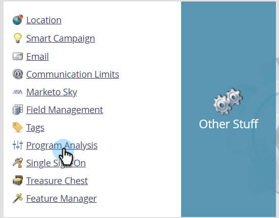

# Sincronizar campos personalizados com insights de desempenho {#sync-custom-fields-to-performance-insights}

Os painéis de Receita e Pipeline MPI podem filtrar em campos de Marketing personalizados. para fazer isso, é necessário definir os campos personalizados a serem sincronizados.

>[!NOTE]
>
>**Permissões de administrador necessárias**

>[!NOTE]
>
>Este artigo é somente para usuários que **não** têm [RCA](http://docs.marketo.com/x/lwIk). Se você tiver RCA, siga as etapas [deste artigo](http://docs.marketo.com/x/FQQk).

1. Vá para a seção **Admin** .

   

1. Em Outras coisas, selecione Análise **do Programa**.

   

1. Clique na guia Sincronização **de campo** personalizado.

   

1. Selecione o campo para o qual deseja ativar a sincronização e clique em **Editar opção** de sincronização.

   

1. Altere o Status **de** sincronização para **Ativado**.

   

1. Selecione o Tipo **** RCA de sua escolha e clique em **Salvar**.

   

   >[!NOTE]
   >
   >Depois de habilitados, os campos estarão disponíveis em MPI no dia seguinte.

