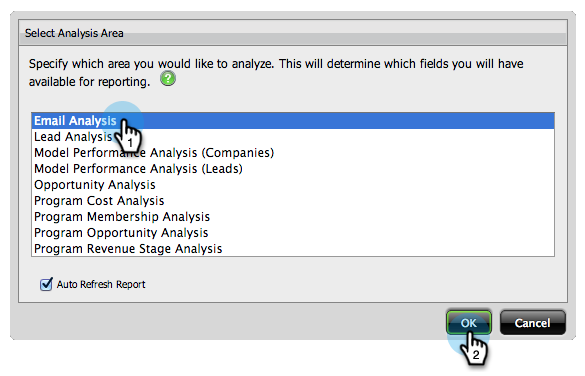
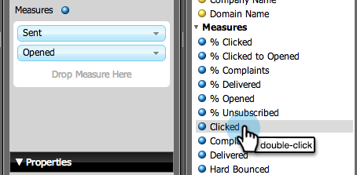
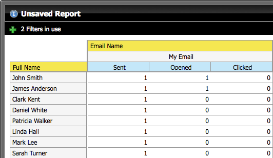

# Crie um relatório de Análise por email que o Lista lidera {#build-an-email-analysis-report-that-lists-leads}

>[!NOTE]
>
>**Disponibilidade**
>
>Nem todos os clientes adquiriram essa funcionalidade. Entre em contato com seu representante de vendas para obter detalhes.

Siga estas etapas para criar um relatório de Análise por email que mostrará cada cliente potencial enviado a um email específico. Esse relatório também incluirá estatísticas de Clique e Abrir. 1. Inicie o Explorador de Receita.

1. Clique em Novo relatório.

   

1. Selecione a área Análise de email e clique em OK.

   

1. Localize o ponto amarelo Nome do email, clique nele com o botão direito do mouse e selecione Filtrar.

   

1. Clique no e-mail de sua escolha na lista e clique em OK.

   

1. Arraste o ponto amarelo Nome do email para Colunas.

   

   >[!TIP]
   >
   >Há muitos atributos de lead/empresa que você pode adicionar como colunas, dê uma olhada!

1. Localize o ponto amarelo Nome completo e arraste-o para Linhas.

   

1. Agora, adicione as Medidas de que você está interessado clicando nelas no duplo.

   

>[!NOTE]
>
>Dependendo da quantidade de dados que você possui, esse relatório pode levar algum tempo para ser atualizado.

Agora que você terminou, seu relatório deve se parecer com isso:   

Missão completa!
