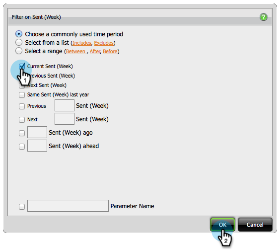

# Criar um relatório de análise de e-mail que mostre informações do programa {#build-an-email-analysis-report-that-shows-program-information}

Siga estas etapas para criar um Relatório de análise de email que mostrará informações de email agrupadas por canais do programa.

>[!AVAILABILITY]
>
>Nem todos compraram este recurso. Entre em contato com a equipe de conta da Adobe (seu gerente de conta) para obter mais detalhes.

1. Iniciar o **[!UICONTROL Gerenciador de Receita]**.

   

1. Clique em **[!UICONTROL Criar novo]** e selecione **[!UICONTROL Relatório]**.

   

1. Selecione a área **[!UICONTROL Análise de email]** e clique em **[!UICONTROL OK]**.

   

1. Localize o ponto amarelo **[!UICONTROL Enviado (Semana)]** e clique com o botão direito nele. Clique em **[!UICONTROL Filtro...]**.

   >[!NOTE]
   >
   >Isso reduzirá o período do relatório.

   

1. Marque **[!UICONTROL Enviado Atual (Semana)]** e clique em **[!UICONTROL OK]**.

   

1. Localize e clique duas vezes no **[!UICONTROL Canal do programa]** ponto amarelo.

   

1. Localize e clique duas vezes no **[!UICONTROL Nome do email]** ponto amarelo.

   

1. Localize e clique duas vezes nos pontos azuis **[!UICONTROL Enviado]**, **[!UICONTROL Aberto]** e **[!UICONTROL Clicado]**.

   

   Excelente trabalho! Você deve ter um relatório semelhante a este:

   
