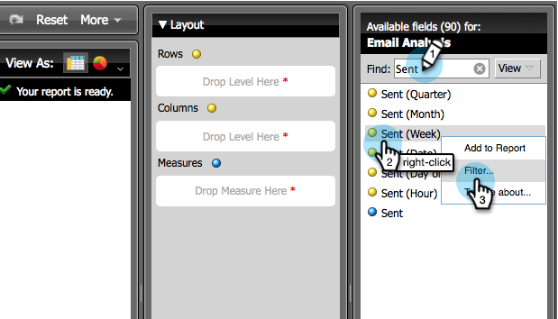

# Criar um relatório de análise de email que mostre informações do programa {#build-an-email-analysis-report-that-shows-program-information}

Siga estas etapas para criar um Relatório de análise de email que mostrará informações de email agrupadas por canais de programas.

>[!AVAILABILITY]
>
>Nem todos compraram esse recurso. Entre em contato com a equipe de conta do Adobe (seu gerente de conta) para obter detalhes.

1. Launch **Explorador de receita**.

   

1. Clique em **Criar novo** e selecione **Relatório**.

   

1. Selecionar **Análise de email** e clique em **OK**.

   

1. Encontre a **Enviado (Semana)** ponto amarelo e clique com o botão direito nele. Clique em **Filtro**.

   >[!NOTE]
   >
   >Isso reduzirá o período do relatório.

   

1. Verificar **Semana de Envio Atual** e clique em **OK**.

   

1. Localize e clique duas vezes na guia **Canal do programa** ponto amarelo.

   

1. Localize e clique duas vezes na guia **Nome do email** ponto amarelo.

   

1. Localize e clique duas vezes na guia **Enviado**, **Aberto** e **Clicado** pontos azuis.

   

   Muito bem! Você deve ter um relatório semelhante a este:

   
