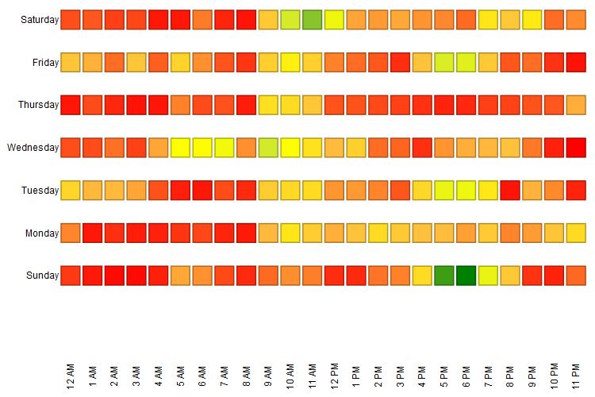

# Noções básicas sobre a área de análise de email {#understanding-the-email-analysis-area}

A Área de análise de email se concentra nas métricas de email. Este artigo apresenta todos os relatórios disponíveis nele.

>[!AVAILABILITY]
>
>Isso está disponível para usuários com o complemento Select Edition ou [Revenue Cycle Analytics](https://www.marketo.com/global-enterprise/marketo-revenue-cycle-analytics/). Confira os detalhes com seu representante de vendas.

## Grade de Aquecimento de Atividades de Clique de Email {#email-click-activity-heat-grid}

Este relatório mostra o dia da semana e a hora do dia em que seus clientes potenciais estão clicando nos emails. Quanto mais verde a caixa, mais cliques nesse dia e hora específicos. O filtro atual inclui todos os emails enviados nos últimos 7 dias. O tempo está em CST.

## Distribuição de tempo de clique de email {#email-clicked-time-distribution}

Este relatório mostra a porcentagem do total de cliques em emails para cada hora do dia. O filtro atual inclui todos os emails enviados nos últimos 7 dias. O tempo está em CST.

## Declínio da taxa de cliques de email {#email-click-rate-decay}

Este relatório mostra a porcentagem do total de cliques em emails que ocorreram no mesmo dia em que um email foi enviado e nos dias seguintes. O filtro atual inclui todos os emails enviados há 7 dias.

## Grade de Aquecimento de Atividades Abertas de Email {#email-open-activity-heat-grid}

Este relatório mostra o dia da semana e a hora do dia em que seus clientes potenciais estão abrindo emails. Quanto mais verde a caixa, mais aberta nesse dia e hora específicos. O filtro atual inclui todos os emails enviados nos últimos 7 dias. O tempo está em CST.

## Declínio da taxa de abertura {#open-rate-decay}

Este relatório mostra a porcentagem do total de aberturas de email ocorridas no mesmo dia em que um email é enviado e nos dias seguintes. O filtro atual inclui todos os emails enviados há 7 dias.

## Distribuição de tempo em aberto {#open-time-distribution}

Este relatório mostra a porcentagem do total de aberturas de email para cada hora do dia. O filtro atual inclui todos os emails enviados nos últimos 7 dias. O tempo está em CST.

## Grade de Calor de Atividade Enviada {#sent-activity-heat-grid}

Este relatório mostra o dia da semana e a hora do dia em que você está enviando seus emails. Quanto mais verde for a caixa, mais emails serão enviados nesse dia e hora específicos. O filtro atual inclui todos os emails enviados nos últimos 7 dias. O tempo está em CST.

