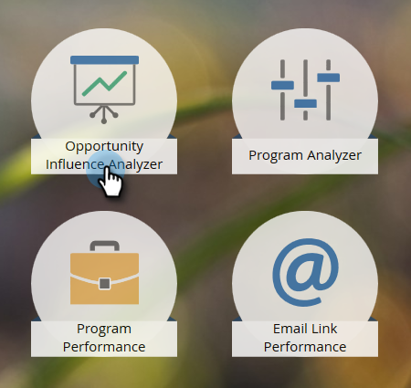

# Criar um analisador de influência de oportunidade {#create-an-opportunity-influence-analyzer}

Use o Analisador de influência de oportunidade para mostrar a contribuição do marketing para um negócio importante. Veja seus sucessos de programa e evento, assim como momentos interessantes, na vida de uma oportunidade.

>[!NOTE]
>
>**Lembrete**
>
>Para obter uma boa informação de um Analisador de influência de oportunidade, verifique se seus contatos estão vinculados às oportunidades em seu CRM.

1. Clique em **Analytics**.

   

1. Clique em Analisador de influência de **oportunidade**.

   

1. Selecione a conta no painel **Configurações** .

   

   >[!NOTE]
   >
   >Se você receber um aviso de que não havia atividades durante o período, clique em **Fechar**. Voltaremos a isso depois do próximo passo.

1. Selecione a oportunidade nessa conta.

   

1. Defina o período de tempo. Clique na guia **Configuração** e clique com o duplo em **Intervalo de tempo**.

   

1. Selecione o período de tempo da oportunidade que deseja analisar e clique em **Salvar**.

   

   >[!TIP]
   >
   >
   >Na maioria dos casos, **All Time** é a escolha mais simples.

1. Você está aí! Clique na guia principal para ver os momentos interessantes e os sucessos envolvidos na oportunidade.

   

>[!TIP]
>
>Você também pode assistir a um vídeo sobre o Opportunity Influence Analyzer na Universidade [de](https://learn.marketo.com)Marketo. (Parece um pouco diferente agora, mas ainda há muito a aprender!)

>[!MORELIKETHIS]
>
>* [Informe a história de marketing com um analisador de influência de oportunidade](tell-the-marketing-story-with-an-opportunity-influence-analyzer.md)
>* [Configurar um analisador de influência de oportunidade](configure-an-opportunity-influence-analyzer.md)

>

>[!NOTE]
>
>**Mergulho profundo**
>
>Para outros analisadores, consulte Relatórios [básico](http://docs.marketo.com/display/docs/basic+reporting).

