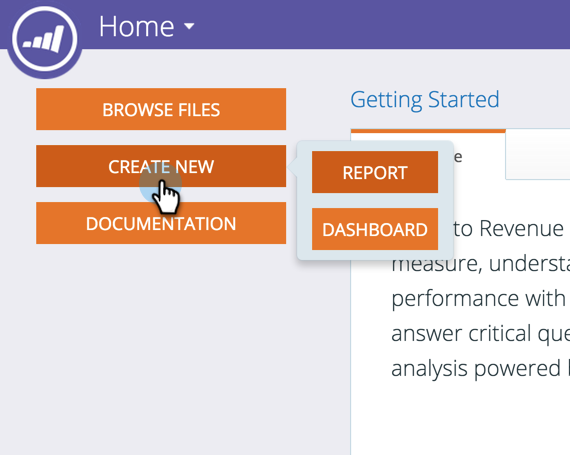

# Visão geral dos relatórios avançados do programa {#advanced-program-reporting-overview}

**Explorador de Ciclo de Receita** O inclui várias áreas de análise e uma grande variedade de novas métricas que permitem medir a eficácia do programa.

Há muitas guloseimas aqui. Vamos conferir!

## O que é uma Área de Análise? {#whats-an-analysis-area}

As áreas de análise contêm diferentes conjuntos de dados e métricas no Explorador de Receita. Cada área se relaciona ao assunto de relatório que você escolheu visualizar.

## Áreas de análise do programa {#program-analysis-areas}

* **[Análise de custo do programa](understanding-the-program-cost-analysis-area.md)** - Consulte o ROI de todos os seus programas.

* **[Análise de adesão ao programa](understanding-the-program-membership-analysis-area.md)** - Veja os resultados por canal, participação, critérios de sucesso etc.

* **[Análise de oportunidades do programa](understanding-the-program-opportunity-analysis-area.md)** - Oportunidades geradas com base na distribuição, nas suas receitas e no ROI.

* **[Análise de Estágio de Receita do Programa](understanding-the-program-revenue-stage-analysis-area.md)** - Novos nomes que atingiram estágios de sucesso específicos dentro do modelo de ciclo de receita.

## Analisadores de programa {#program-analyzers}

* **Analisador de programas** - Identifique rapidamente os programas que são ou não bem-sucedidos e concentre seus recursos adequadamente.

* **Analisador de influência de oportunidade** - Provar a contribuição do Marketing medindo o impacto dos programas e dos principais compromissos que geraram oportunidades.

## Opções de relatório {#report-options}

Em cada relatório há várias opções disponíveis para ajudar você a personalizar a experiência.

>[!CAUTION]
>
>Embora tenha a opção de mostrar Linhas/Colunas nas quais a célula de Medida é deixada em branco (primeira caixa de seleção), recomendamos que não faça isso, pois poderia retardar o processamento e pode até mesmo esgotar o tempo limite do relatório.

>[!NOTE]
>
>Os dados no Revenue Cycle Explorer são atualizados à noite a partir da sua instância do Marketo. Portanto, qualquer alteração na atividade de sua pessoa e conta dentro do Marketo será refletida no seguinte dia útil no Revenue Cycle Explorer.

Familiarizar-se com a Análise de receita lhe dará uma visão completa dos seus programas e seu impacto.
