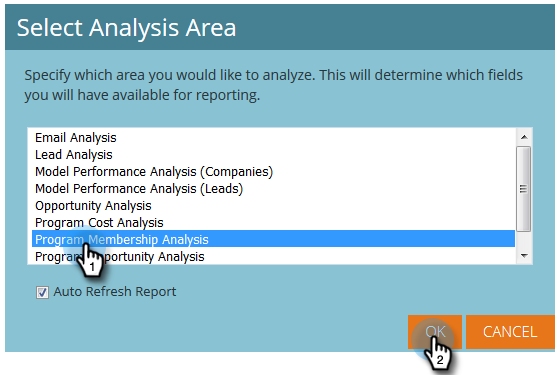
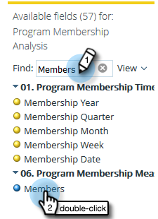

# Criar um relatório de análise de associação ao programa que liste clientes em potencial {#build-a-program-membership-analysis-report-that-lists-leads}

Siga estas etapas para criar um relatório de Análise de programa que mostrará todos os nomes de membros do programa.

>[!AVAILABILITY]
>
>Nem todos os usuários do Marketo Engage compraram essa funcionalidade. Entre em contato com a equipe de conta do Adobe (seu gerente de conta) para obter mais detalhes.

1. Inicie o Explorador de receita.

   

1. Clique em **Criar novo** e depois em **Relatório**.

   

1. Selecione **Análise de Associação de Programa** e clique em **OK**.

   

1. Localize e clique duas vezes no ponto amarelo Nome do programa.

   

1. Localize e clique duas vezes no ponto azul Membros.

   

1. Localize e clique duas vezes no ponto azul de Sucesso (Total).

   

Viu como foi fácil?

Você pode adicionar rapidamente um atributo de cliente potencial, como _Nome Completo_, para ver quem são os membros.

>[!TIP]
>
>Há muitos atributos de cliente potencial/empresa entre os quais escolher. Dê uma olhada!

1. Localize e clique duas vezes no ponto amarelo **Nome Completo**.

   

É isso aí!

