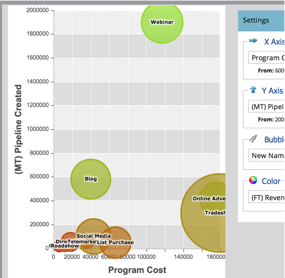

# Compare a eficácia do Canal com o analisador de Programas {#compare-channel-effectiveness-with-the-program-analyzer}

Use o Analisador de Programas para comparar os custos de canais, aquisição de membros, pipeline, receita e muito mais, para identificar seus canais mais eficazes e menos eficazes.

>[!PREREQUISITES]
>
>* [Criar um analisador de Programas](create-a-program-analyzer.md)

1. Clique em **Analytics** em **My Marketo.**

   

1. Selecione o seu Analisador de Programas **.**

   

1. Altere a Visualização para **By** **Canal**.

   

1. Use o menu suspenso **Eixo X** para escolher uma métrica para o eixo horizontal. Vamos start com **Custo do Programa**.

   

1. Use o menu suspenso Eixo Y para escolher uma métrica para o eixo vertical. Aqui, iremos com o **(FT) Pipeline Criado**.

   

   >[!NOTE]
   >
   >Muitas das métricas que você pode escolher no analisador de programas estão disponíveis com cálculos de primeiro toque (FT) e multitoque (MT). É importante entender a diferença [entre a atribuição FT e MT](/help/marketo/product-docs/reporting/revenue-cycle-analytics/revenue-tools/attribution/understanding-attribution.md).

1. Use o menu suspenso **Eixo Y** para escolher **(MT) Pipeline criado**.

   

   Nesta visualização de atribuição multitoque, vemos que o canal Webinar tem mais influência no pipeline criado e custa menos do que os canais de exibição de publicidade online e de shows de vendas.

   Agora vamos adicionar mais duas dimensões!

1. Use o menu suspenso **Tamanho da bolha** para selecionar uma medida adicional, como **Novos nomes**.

   

1. Observe como o gráfico muda.

   

   Vemos que o canal do Webinar encolhe, conforme medido por **Novos nomes**. Podemos concluir que, apesar de ter muitos membros, é menos eficaz em gerar novas perspectivas do que o canal de feiras.

1. Por fim, use o menu suspenso Cor para adicionar a quarta dimensão. Vamos selecionar **(FT) Revenue** **Won**.

   

1. Observe as cores mudarem no seu gráfico.

   

   A partir das cores, aprendemos que o canal de shows de vendas, a bolha mais verde, influenciou a maior receita obtida, medida pela atribuição de primeiro toque.

1. Agora, se mudarmos a métrica Cor para **(MT) Revenue Won**, veremos que o canal de Anúncios online, agora o mais verde, influenciou mais a receita - ao longo do tempo_ do que os canais de Webinar e de shows de vendas.

   

Em nosso exemplo, vemos que o canal de apresentação comercial é o mais caro (mais à direita) e o mais bem sucedido (mais alto no eixo Y) ao medir o pipeline criado pelo primeiro toque. Agora, vamos considerar cada pipeline de canal criado como medido pela atribuição multitoque.

>[!TIP]
>
>Os exemplos nessas etapas avaliam a eficácia com base no pipeline criado. Use o menu suspenso Eixo Y para selecionar outras maneiras de medir a eficácia do canal, como Novos nomes, Membros, Custo por sucesso etc.

>[!NOTE]
>
>**Artigos relacionados**
>
>* [Explore os detalhes do Programa e Canal com o Analisador de Programas](explore-program-and-channel-details-with-the-program-analyzer.md)
>* [Compare a eficácia do Programa com o analisador de Programas](compare-program-effectiveness-with-the-program-analyzer.md)

>

>[!NOTE]
>
>Saiba mais sobre análises avançadas no [Explorador do Ciclo de Receita](http://docs.marketo.com/display/docs/revenue+cycle+analytics).
