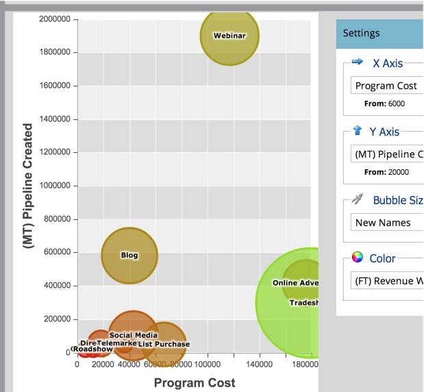

# Compare a eficácia do canal com o [!UICONTROL Analisador de programas] {#compare-channel-effectiveness-with-the-program-analyzer}

Use o [!UICONTROL Analisador de Programas] para comparar os custos de canal, aquisição de membros, pipeline, receita e muito mais, para identificar seus canais mais e menos eficazes.

>[!PREREQUISITES]
>
>[Criar um [!UICONTROL Analisador de Programas]](/help/marketo/product-docs/reporting/revenue-cycle-analytics/program-analytics/create-a-program-analyzer.md)

1. Clique no **[!UICONTROL Analytics]** em **Minha Marketo**.

   

1. Selecione o Analisador de programa.

   

1. Altere a exibição para **[!UICONTROL Por canal]**.

   

1. Use o menu suspenso **[!UICONTROL Eixo X]** para escolher uma métrica para o eixo horizontal. Vamos começar com **[!UICONTROL Custo do programa]**.

   

1. Use o menu suspenso **[!UICONTROL Eixo Y]** para escolher uma métrica para o eixo vertical. Aqui, vamos com o pipeline **[!UICONTROL (FT) criado]**.

   

   >[!NOTE]
   >
   >Muitas das métricas que você pode escolher no analisador de programa estão disponíveis com cálculos de primeiro toque (FT) e multitoque (MT). É importante entender a [diferença entre a atribuição FT e MT](/help/marketo/product-docs/reporting/revenue-cycle-analytics/revenue-tools/attribution/understanding-attribution.md).

1. Use o menu suspenso **[!UICONTROL Eixo Y]** para escolher o Pipeline **[!UICONTROL (MT) Criado]**.

   

   Nesta visualização de atribuição multitoque, vemos que o canal de webinário tem mais influência no pipeline criado e custa menos do que os canais de Tradeshow e Advertising online.

   Agora vamos adicionar mais duas dimensões!

1. Use o menu suspenso **[!UICONTROL Tamanho da Bolha]** para selecionar uma medida adicional, como **[!UICONTROL Novos Nomes]**.

   

1. Veja como o gráfico muda.

   

   Vemos que o canal do Webinar fica reduzido, conforme medido por **[!UICONTROL Novos Nomes]**. Podemos concluir que, embora tenha muitos membros, é menos eficaz na geração de novos leads do que o canal Tradeshow.

1. Por fim, use o menu suspenso Cor para adicionar a quarta dimensão. Vamos selecionar **[!UICONTROL (FT) Receita conquistada]**.

   

1. Veja as cores mudarem no seu gráfico.

   

   Com base nas cores, descobrimos que o canal Tradeshow, a bolha mais verde, influenciou a maior receita obtida, medida pela atribuição de primeiro contato.

1. Agora, se alterarmos a métrica de Cor para **[!UICONTROL (MT) Receita Ganha]**, veremos que o canal do Online Advertising, agora o mais ecológico, influenciou mais receita _ao longo do tempo_ do que os canais de Webinar e Tradeshow.

   

Em nosso exemplo, vemos que o canal de Tradeshow é o mais caro (mais à direita) e o mais bem-sucedido (mais alto no eixo Y) ao medir o pipeline criado pelo primeiro contato. Agora, vamos considerar o pipeline de cada canal criado como medido pela atribuição multitoque.

>[!TIP]
>
>Os exemplos dessas etapas medem a eficácia com base no pipeline criado. Use o menu suspenso [!UICONTROL Eixo Y] para selecionar outras maneiras de medir a eficácia do canal, como [!UICONTROL Novos Nomes], [!UICONTROL Membros], [!UICONTROL Custo por Sucesso] etc.

>[!MORELIKETHIS]
>
>* [Explore detalhes do programa e do canal com o [!UICONTROL Analisador de programas]](/help/marketo/product-docs/reporting/revenue-cycle-analytics/program-analytics/explore-program-and-channel-details-with-the-program-analyzer.md)
>* [Comparar a eficácia do programa com o [!UICONTROL Analisador de programas]](/help/marketo/product-docs/reporting/revenue-cycle-analytics/program-analytics/compare-program-effectiveness-with-the-program-analyzer.md)
