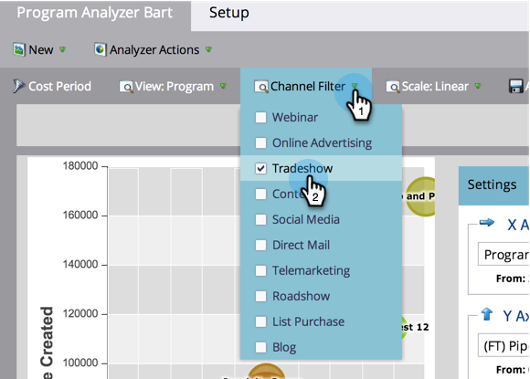

# Compare a eficácia do programa com o [!UICONTROL Analisador de programas] {#compare-program-effectiveness-with-the-program-analyzer}

Use o [!UICONTROL Analisador de Programas] para identificar seus programas mais e menos eficazes, comparando os custos do programa, a aquisição de membros, o pipeline e a receita.

>[!PREREQUISITES]
>
>[Criar um [!UICONTROL Analisador de Programas]](/help/marketo/product-docs/reporting/revenue-cycle-analytics/program-analytics/create-a-program-analyzer.md)

1. Clique em **[!UICONTROL Analytics]**.

   

1. Selecione o Analisador de programa.

   

1. Altere a exibição para **[!UICONTROL Por Programa]**.

   

1. Use o **[!UICONTROL Filtro de Canal]** para reduzir a exibição para apenas um ou dois canais. Por enquanto, examinaremos os programas no canal **[!UICONTROL Tradeshow]**.

   

   >[!TIP]
   >
   >Uma maneira rápida de filtrar programas para apenas um canal é selecionar **[!UICONTROL Exibir]** > **[!UICONTROL Por Canal]**, clicar no balão desse canal e clicar no nome do canal na caixa de diálogo pop-up.

1. Use o menu suspenso **[!UICONTROL Eixo X]** para escolher uma métrica para o eixo horizontal. Começaremos com **[!UICONTROL Custo do Programa]**.

   

1. Use o menu suspenso **[!UICONTROL Eixo Y]** para escolher uma métrica para o eixo vertical. Vamos escolher **[!UICONTROL Novos nomes]** para encontrar programas que sejam bons em capturar novos clientes potenciais.

   

1. Ative os controles deslizantes para ampliar.

   

   >[!TIP]
   >
   >Você também pode tentar melhorar a visualização alterando de uma escala linear para logarítmica, ou vice-versa. Use o menu **[!UICONTROL Escala]** na parte superior.

1. Explore o gráfico resultante.

   

   Em nosso exemplo, descobrimos que o [!DNL Origami Expo] é muito melhor do que todos os outros programas desse canal para capturar novos nomes e a um custo médio. Mas essa não é a história toda. Adicionaremos mais duas métricas para obter uma compreensão mais profunda.

1. Use o menu suspenso **[!UICONTROL Tamanho da Bolha]** para escolher uma métrica a ser comparada pelo tamanho das bolhas. Escolheremos **[!UICONTROL (FT) Receita Ganha]** como nosso exemplo.

   

   >[!NOTE]
   >
   >Muitas das métricas que você pode escolher no analisador de programa estão disponíveis com cálculos de primeiro toque (FT) e multitoque (MT). É importante entender a [diferença entre a atribuição FT e MT](/help/marketo/product-docs/reporting/revenue-cycle-analytics/revenue-tools/attribution/understanding-attribution.md).

1. Veja as bolhas mudarem de tamanho no gráfico.

   

   Ao adicionar **[!UICONTROL (FT) Receita Ganha]**, vemos rapidamente que, embora o [!DNL Origami Expo] tenha adquirido muitos novos nomes, isso resulta em relativamente pouca receita. Além disso, vemos que o programa [!DNL Paper Fest 12] está recebendo menos, mas nomes melhores, pois influencia mais receita obtida (bolha maior).

1. Use o menu suspenso Cor para adicionar uma quarta métrica. Verificaremos **[!UICONTROL (FT) Receita para Investimento]**.

   

1. Veja as cores mudarem no seu gráfico.

   

Vemos que o programa [!DNL Paper Fest 12] não apenas influencia mais receita (bolha maior), mas apesar de seu custo de programa relativamente alto (no lado direito), ele tem o melhor retorno de investimento (bolha mais verde) de todos os programas no canal [!UICONTROL Tradeshow].

>[!TIP]
>
>Você pode comparar rapidamente os programas em um canal com aqueles em outro. Basta usar o **Filtro de canal** na parte superior da janela para adicionar mais canais.

>[!MORELIKETHIS]
>
>* [Explore detalhes do programa e do canal com o [!UICONTROL Analisador de programas]](/help/marketo/product-docs/reporting/revenue-cycle-analytics/program-analytics/explore-program-and-channel-details-with-the-program-analyzer.md)
>* [Comparar eficácia do canal com o [!UICONTROL Analisador de programas]](/help/marketo/product-docs/reporting/revenue-cycle-analytics/program-analytics/compare-channel-effectiveness-with-the-program-analyzer.md)
