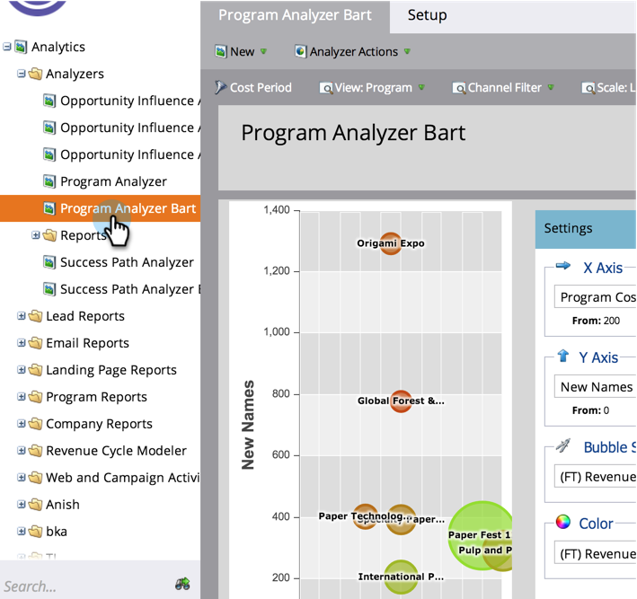

# Compare a eficácia do programa com o Analisador de programa {#compare-program-effectiveness-with-the-program-analyzer}

Use o Analisador de programas para identificar seus programas mais e menos eficazes, comparando os custos do programa, a aquisição de membros, o pipeline e a receita.

>[!PREREQUISITES]
>
>[Criar um Analisador de Programa](/help/marketo/product-docs/reporting/revenue-cycle-analytics/program-analytics/create-a-program-analyzer.md)

1. Clique em **Analytics**.

   

1. Selecione o Analisador de programa.

   

1. Altere a exibição para Por programa.

   

1. Use o Filtro de canal para reduzir a exibição para apenas um ou dois canais. Por enquanto, observaremos os programas no canal Tradeshow.

   

   >[!TIP]
   >
   >Uma maneira rápida de filtrar programas para apenas um canal é selecionar **Exibir** > **Por Canal**, clicar no balão desse canal e clicar no nome do canal na caixa de diálogo pop-up.

1. Use o menu suspenso Eixo X para escolher uma métrica para o eixo horizontal. Começaremos com o Custo do programa.

   

1. Use o menu suspenso Eixo Y para escolher uma métrica para o eixo vertical. Vamos escolher Novos nomes para encontrar programas que sejam bons em capturar novos leads.

   

1. Ative os controles deslizantes para ampliar.

   

   >[!TIP]
   >
   >Você também pode tentar melhorar a visualização alterando de uma escala linear para logarítmica, ou vice-versa. Use o menu **Escala** na parte superior.

1. Explore o gráfico resultante.

   

   Em nosso exemplo, aprendemos que a Origami Expo é muito melhor do que todos os outros programas nesse canal para capturar novos nomes, e a um custo médio. Mas essa não é a história toda. Adicionaremos mais duas métricas para obter uma compreensão mais profunda.

1. Use a lista suspensa Tamanho da bolha para escolher uma métrica para comparar pelo tamanho das bolhas. Escolheremos Receita Ganha (FT) como nosso exemplo.

   

   >[!NOTE]
   >
   >Muitas das métricas que você pode escolher no analisador de programa estão disponíveis com cálculos de primeiro toque (FT) e multitoque (MT). É importante entender a [diferença entre a atribuição FT e MT](/help/marketo/product-docs/reporting/revenue-cycle-analytics/revenue-tools/attribution/understanding-attribution.md).

1. Veja as bolhas mudarem de tamanho no gráfico.

   

   Ao adicionar **(FT) Receita Ganha**, vemos rapidamente que, embora a Origami Expo tenha adquirido muitos novos nomes, isso resulta em relativamente pouca receita. Além disso, vemos que o programa Paper Fest 12 está recebendo menos, mas nomes melhores, já que influencia mais receita conquistada (bolha maior).

1. Use o menu suspenso Cor para adicionar uma quarta métrica. Examinaremos a receita (FT) para investimento.

   

1. Veja as cores mudarem no seu gráfico.

   

Vemos que o programa Paper Fest 12 não só influencia mais receita (bolha maior), mas, apesar de seu custo de programa relativamente alto (no lado direito), tem o melhor retorno ao investimento (bolha mais verde) de todos os programas no canal Tradeshow.

>[!TIP]
>
>Você pode comparar rapidamente os programas em um canal com aqueles em outro. Basta usar o **Filtro de canal** na parte superior da janela para adicionar mais canais.

>[!MORELIKETHIS]
>
>* [Explore detalhes do programa e do canal com o Analisador de programa](/help/marketo/product-docs/reporting/revenue-cycle-analytics/program-analytics/explore-program-and-channel-details-with-the-program-analyzer.md)
>* [Comparar a eficácia do canal com o Analisador de programa](/help/marketo/product-docs/reporting/revenue-cycle-analytics/program-analytics/compare-channel-effectiveness-with-the-program-analyzer.md)
