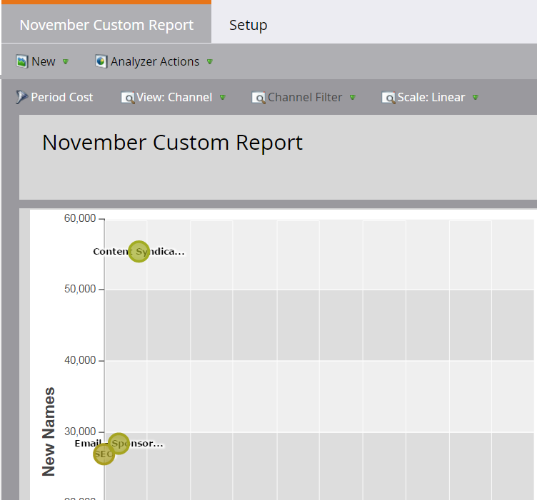

# Criar um analisador de programa {#create-a-program-analyzer}

Descubra quais programas e canais estão dando a você o maior retorno sobre o investimento em marketing. Use o analisador de programas para examinar e comparar cada custo e retorno em detalhes, por programa ou por canal.

>[!NOTE]
>
>Para obter bons dados de um analisador de programa, verifique se os contatos do CRM têm funções nas oportunidades e se seus programas do Marketo estão totalmente configurados, com [custos do período](/help/marketo/product-docs/reporting/revenue-cycle-analytics/revenue-tools/define-period-costs.md), status de programa e êxito definidos.

>[!TIP]
>
>Para que programas sem custo apareçam no analisador de programas, [defina o custo do período](/help/marketo/product-docs/reporting/revenue-cycle-analytics/revenue-tools/define-period-costs.md) como $0.

1. Clique no bloco **Analytics**.

   

1. Clique no bloco **Analisador de programas**.

   

1. O analisador de programa padrão é exibido. Faça as alterações necessárias.

   

1. Clique na guia **Configuração** para adicionar e personalizar filtros.

   

1. Por exemplo, para personalizar o filtro Custo do Período, clique duas vezes nele.

   

1. Selecione o período que deseja analisar e clique em **Aplicar**.

   

   >[!TIP]
   >
   >Para selecionar um intervalo específico, selecione **Personalizado** e use os campos **De** e **Até**.

1. Para salvar o novo analisador personalizado, no menu suspenso Ações do Analisador, selecione **Salvar como**.

   

1. Selecione o local em que deseja salvar o analisador personalizado, usando os menus suspensos Salvar em e Pasta. Atribua um nome ao novo analisador personalizado. Uma descrição é opcional. Clique em **Salvar**.

   

1. Você conseguiu! Clique na guia principal para começar a explorar e comparar seus programas e canais.

>[!NOTE]
>
>Muitas das métricas que você pode escolher no analisador de programa estão disponíveis com cálculos de primeiro toque (FT) e multitoque (MT). É importante entender a [diferença entre a atribuição FT e MT](/help/marketo/product-docs/reporting/revenue-cycle-analytics/revenue-tools/attribution/understanding-attribution.md).

>[!MORELIKETHIS]
>
>* [Comparar a eficácia do canal com o Analisador de programa](/help/marketo/product-docs/reporting/revenue-cycle-analytics/program-analytics/compare-channel-effectiveness-with-the-program-analyzer.md)
>* [Comparar a eficácia do programa com o Analisador de programas](/help/marketo/product-docs/reporting/revenue-cycle-analytics/program-analytics/compare-program-effectiveness-with-the-program-analyzer.md)
>* [Explore detalhes do programa e do canal com o Analisador de programa](/help/marketo/product-docs/reporting/revenue-cycle-analytics/program-analytics/explore-program-and-channel-details-with-the-program-analyzer.md)
>* [Clonar um Analisador de Programa](/help/marketo/product-docs/reporting/revenue-cycle-analytics/program-analytics/clone-a-program-analyzer.md)
