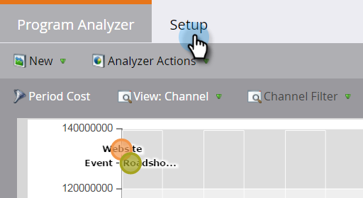

# Criar um analisador de Programas {#create-a-program-analyzer}

Descubra quais programas e canais estão lhe dando o maior incentivo para seu investimento em marketing. Use o analisador de programas para analisar e comparar cada custo e retorno em detalhes, por programa ou por canal.

>[!NOTE]
>
>**Lembrete**
>
>Para obter bons dados de um analisador de programas, verifique se seus contatos do CRM têm funções nas oportunidades e se os programas de marketing estão totalmente configurados, com custos [de](/help/marketo/product-docs/reporting/revenue-cycle-analytics/revenue-tools/define-period-costs.md)período, status de programa e sucesso definidos.

>[!TIP]
>
>Para que programas sem custo apareçam no analisador de programas, [defina o custo](/help/marketo/product-docs/reporting/revenue-cycle-analytics/revenue-tools/define-period-costs.md) do período para $0.

1. Clique no bloco Analytics.

   

1. Clique no bloco Analisador de Programas.

   

1. O analisador de programa padrão é exibido. Faça as alterações necessárias.

   

1. Clique na guia Configuração para adicionar e personalizar filtros.

   

1. Por exemplo, para personalizar o filtro Custo do Período, clique com o duplo no filtro.

   

1. Selecione o período que deseja analisar e clique em Aplicar.

   

   >[!TIP]
   >
   >Para selecionar um intervalo específico, selecione **Personalizado** e use os campos **De** e **Para** .

1. Se quiser salvar seu novo analisador personalizado, no menu suspenso Ações do Analyzer, selecione Salvar como.

   

1. Selecione o local onde deseja salvar o analisador personalizado, usando os menus suspensos Salvar em e Pasta. Nomeie o novo analisador personalizado. Uma descrição é opcional. Clique em Salvar.

   

1. Você fez isso! Clique na guia principal para explorar e comparar os programas e canais.

>[!NOTE]
>
>**Artigos relacionados**
>
>* [Compare a eficácia do Canal com o analisador de Programas](compare-channel-effectiveness-with-the-program-analyzer.md)
>* [Compare a eficácia do Programa com o analisador de Programas](compare-program-effectiveness-with-the-program-analyzer.md)
>* [Explore os detalhes do Programa e Canal com o Analisador de Programas](explore-program-and-channel-details-with-the-program-analyzer.md)
>* [Clonar um analisador de Programas](clone-a-program-analyzer.md)

>[!NOTE]
>
>Muitas das métricas que você pode escolher no analisador de programas estão disponíveis com cálculos de primeiro toque (FT) e multitoque (MT). É importante compreender a [diferença entre a atribuição](/help/marketo/product-docs/reporting/revenue-cycle-analytics/revenue-tools/attribution/understanding-attribution.md)FT e MT.

>[!NOTE]
>
>Saiba mais sobre o Relatórios [básico e o](http://docs.marketo.com/display/docs/basic+reporting) Revenue Cycle Explorer .
