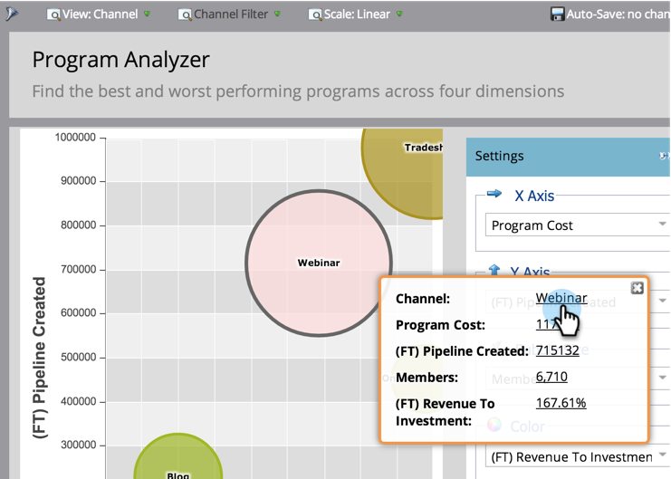

# Explore detalhes do programa e do canal com o [!UICONTROL Analisador de programas] {#explore-program-channel-details-with-the-program-analyzer}

Você pode ver estatísticas detalhadas do programa e do canal no [!UICONTROL Analisador de programas]. Você também pode abri-los no Gerenciador de ciclo de receita.

>[!PREREQUISITES]
>
>[Criar um [!UICONTROL Analisador de Programas]](/help/marketo/product-docs/reporting/revenue-cycle-analytics/program-analytics/create-a-program-analyzer.md)

>[!AVAILABILITY]
>
>Nem todas as edições do Marketo incluem essa funcionalidade. Entre em contato com seu gerente de conta para obter mais detalhes.

1. Clique em **[!UICONTROL Analytics]**.

   

1. Selecione o Analisador de programa.

   

1. Para ver as estatísticas específicas de um canal ou programa (dependendo da **[!UICONTROL Exibição]** selecionada), clique na bolha correspondente.

   

   >[!NOTE]
   >
   >Muitas das métricas que você pode escolher no analisador de programa estão disponíveis com cálculos de primeiro toque (FT) e multitoque (MT). É importante entender a [diferença entre a atribuição FT e MT](/help/marketo/product-docs/reporting/revenue-cycle-analytics/revenue-tools/attribution/understanding-attribution.md).

1. Para comparar todos os programas de um único canal, clique no nome do canal na caixa de diálogo pop-up.

   

1. Agora você pode comparar os programas individuais dentro desse único canal!

   

   >[!NOTE]
   >
   >Clicar em um único canal altera sua visualização para Por programa, filtrado apenas para esse canal. Para retornar a todos os canais, selecione **[!UICONTROL Exibir]** > **[!UICONTROL Por Canal]**.

1. Para abrir o Explorador de ciclo de receita para pesquisar ainda mais uma estatística, clique nesse número na caixa de diálogo pop-up.

   
