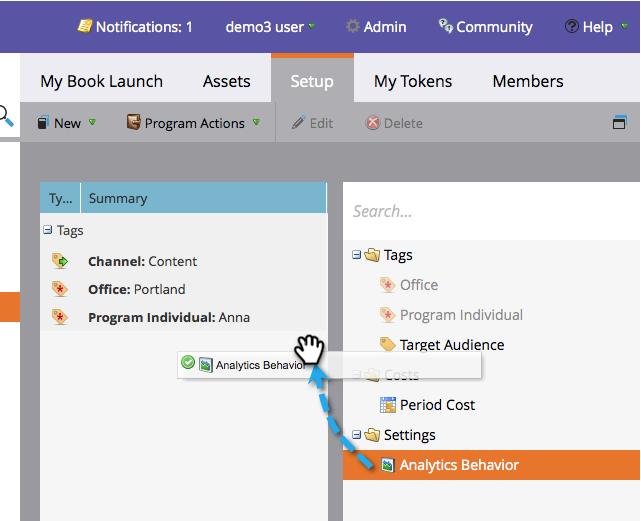

# Substituir o comportamento do Analytics no nível do programa {#override-analytics-behavior-at-the-program-level}

Você pode definir a variável [comportamento do analytics no nível administrativo nos canais](/help/marketo/product-docs/reporting/revenue-cycle-analytics/program-analytics/make-a-program-without-a-period-cost-available-in-revenue-explorer-and-analyzers.md) mas você também pode substituí-lo no nível do programa. Veja como:

1. Vá para a **Atividades de marketing** área.

   

1. Localize e selecione seu programa.

   

1. No **Configuração** arraste Comportamento do Analytics para a tela.

   

1. Selecione o comportamento do Analytics desejado.

   >[!NOTE]
   >
   >**Definição**
   >
   >* **Inclusivo** - Essa opção garantirá que o programa esteja disponível para relatórios no explorador e nos analisadores de receita, independentemente de você ter incluído um custo de período ou não.
   >* **Operacional** - Esta opção faz com que o programa não seja exibido no Gerenciador de receita ou nos analisadores.

   >[!NOTE]
   >
   >O comportamento padrão (se essa configuração não for aplicada) é o programa ser incluído no Analytics **SOMENTE se houver pelo menos um custo de período**, até mesmo um com zero dólares atribuídos.

   

1. Clique em **Salvar**.

   

Muito bem! Agora você sabe como substituir o comportamento do Analytics no nível do programa.

>[!NOTE]
>
>As alterações entrarão em vigor no dia seguinte e serão disponibilizadas ou retiradas do explorador de receita e dos analisadores.
