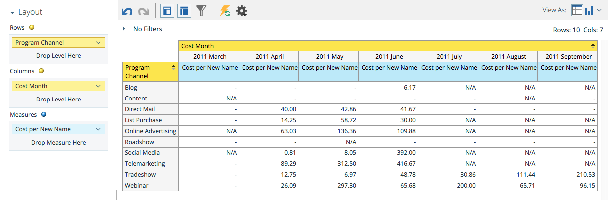
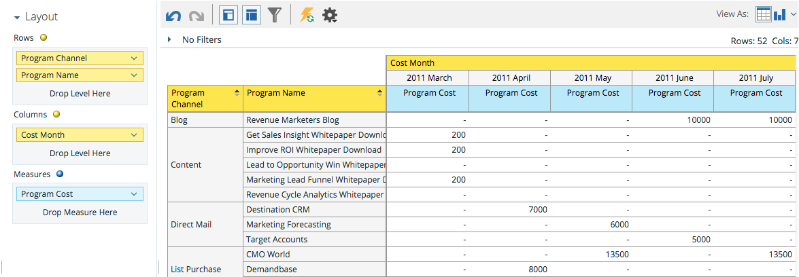

# Entendendo a Área de Análise de Custo do Programa {#understanding-the-program-cost-analysis-area}

A área Análise de custo do Programa permite analisar a eficácia de programas individuais ou ver resultados resumidos por canal em um determinado período de tempo.

## Exemplo de perguntas comerciais {#example-business-questions}

Quantos novos nomes cada canal gerava por mês?

Qual foi o meu custo por novo nome por canal por mês?

Qual porcentagem dos novos nomes gerados alcançou o sucesso em um programa?

Quanto eu gastei por programa por mês?

## Dimension e medidas de Análise de custo do programa {#program-cost-analysis-dimensions-and-measures}

>[!NOTE]
>
>Pontos amarelos são dimensões e pontos azuis são medidas.

## Investimento {#investment}

| Medida | Descrição |
|---|---|
| Custo por membro | Custo médio por membro do programa |
| Custo por novo nome | Custo médio por cliente potencial adquirido pelo programa |
| Custo por sucesso | Custo médio por cliente potencial que obteve sucesso na progressão de um programa |
| Custo por Sucesso (Novos Nomes) | Custo médio por cliente potencial adquirido pelo programa E com êxito na progressão do programa |
| Custo do programa | Custo total do período do programa |

## Associação {#membership}

<table> 
 <tbody> 
  <tr> 
   <th>Medida</th> 
   <th>Descrição</th> 
  </tr> 
  <tr> 
   <td>
% Novos Nomes
</td> 
   <td>Porcentagem de clientes potenciais que foram adquiridos por um programa</td> 
  </tr> 
  <tr> 
   <td>Membros</td> 
   <td>Total de clientes potenciais em um programa</td> 
  </tr> 
  <tr> 
   <td>Novos nomes</td> 
   <td>Total de novos nomes adquiridos por um programa</td> 
  </tr> 
 </tbody> 
</table>

## Atributos do programa {#program-attributes}

| Dimension | Descrição |
|---|---|
| Canal programa | Canal programa |
| Nome do programa | Nome do programa |

## Cronograma de custo do programa {#program-cost-timeframe}

| Dimension | Descrição |
|---|---|
| Ano | Cronograma do custo do programa |
| Trimestre | Período de tempo do Custo do programa |
| Mês | Cronograma do custo do programa |

## Tags de programa {#program-tags}

| Medida | Descrição |
|---|---|
| Indústria | Tag programa |
| Linha de produtos | Tag programa |
| Proprietário do programa | Tag programa |
| Região | Tag programa |

## Êxito {#success}

| Medida | Descrição |
|---|---|
| % de sucesso (novos nomes) | Percentagem de clientes potenciais adquiridos pelo programa E com sucesso na progressão do programa |
| % de sucesso (Total) | Porcentagem de clientes potenciais que obtiveram sucesso na progressão de um programa |
| Sucesso (Novos Nomes) | Número total de novos nomes que obtiveram sucesso na progressão de um programa |
| Sucesso (Total) | Número total de clientes potenciais que obtiveram sucesso na progressão de um programa |

