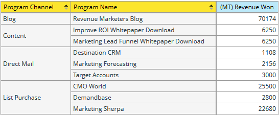

# Como entender a área de análise de oportunidade do programa {#understanding-the-program-opportunity-analysis-area}

## Visão geral {#overview}

A área Análise de oportunidade de programa permite analisar a eficácia de programas individuais ou ver os resultados resumidos por canal do programa.

**Exemplos de perguntas comerciais que você pode responder usando esta área de análise incluem**:

Quantas oportunidades foram associadas a um determinado programa e quantas delas ganhamos?

Qual a receita que um determinado programa ou canal ajudou a gerar?

Qual é minha receita para investimento em um determinado programa ou canal?

Quais oportunidades um determinado programa influenciou?

## Medidas de Atribuição da Análise de Oportunidade do Programa (Pontos Azuis) {#program-opportunity-analysis-attribution-measures-blue-dots}

As medidas disponíveis para você usar na análise geralmente são números e são representadas por pontos azuis. Dimensões são atributos que fornecem visualizações diferentes das medidas e são representadas por pontos amarelos.

Todas as medidas (pontos azuis) estão relacionadas à atribuição - o &quot;crédito&quot; para aquisição de lead ou para o sucesso de vendas associado a um lead.

 

Há três tipos de medidas:

* Medidas relacionadas à aquisição, que recebem atribuição de primeiro contato (FT).
* Medidas relacionadas ao sucesso, que recebem atribuição multitoque (MT).
* Várias medidas relacionadas ao programa, incluindo o número médio de contatos de marketing antes da criação ou fechamento de Oportunidades.

## Aquisição e medidas relacionadas ao sucesso {#acquisition-and-success-related-measures}

As medidas relacionadas à aquisição dão crédito ao programa pelo qual as informações de contato de um lead são obtidas pela primeira vez. Um lead não precisa obter sucesso em um programa para que o crédito de aquisição seja concedido.

O valor de aquisição de um determinado lead muda ao longo do tempo. É zero até que uma compra seja feita pelo lead. Assim, ele pode aumentar com compras adicionais.

As medidas relacionadas com o sucesso atribuem crédito a todos os programas que contribuem para o progresso de um lead rumo a uma compra.

Assim como na aquisição, o valor de contribuir para as vendas feitas a um lead muda ao longo do tempo e é zero até que alguma compra seja feita pelo lead.

<table>
 <tbody>
  <tr>
   <th>Medida de atribuição - relacionada à oportunidade (FT ou MT)*</th>
   <th>Descrição</th>
  </tr>
  <tr>
   <td>Custo de oportunidade</td>
   <td>A porção do custo do programa que influenciou a oportunidade. O custo pode ser dividido se houver vários leads envolvidos.</td>
  </tr>
  <tr>
   <td>Oportunidades criadas</td>
   <td>A parte do crédito que o programa recebeu por influenciar a criação da oportunidade. Pode ser uma fração, caso haja mais de um lead envolvido.</td>
  </tr>
  <tr>
   <td>Oportunidades conquistadas</td>
   <td>A parte do crédito que o programa recebeu por influenciar a oportunidade conquistada. Pode ser uma fração, caso haja mais de um lead envolvido.</td>
  </tr>
  <tr>
   <td>Processamento criado</td>
   <td>Porção de crédito (em valores monetários) recebida pelo programa para influenciar a criação da oportunidade. Pode ser uma fração, caso haja mais de um lead envolvido.</td>
  </tr>
  <tr>
   <td>Pipeline criado - ainda aberto</td>
   <td>Porção de crédito (em valores monetários) recebida pelo programa para influenciar a criação da oportunidade atualmente aberta. Pode ser uma fração, caso haja mais de um lead envolvido.</td>
  </tr>
  <tr>
   <td>Receita esperada</td>
   <td>Porção de crédito (em valores monetários) recebida pelo programa para influenciar a criação da oportunidade. A receita prevista é a probabilidade da oportunidade multiplicada pelo valor da oportunidade. Pode ser uma fração, caso haja mais de um lead envolvido.</td>
  </tr>
  <tr>
   <td>Receita Para Investimento</td>
   <td>Relação entre a porção de crédito (em valores monetários) recebida pelo programa para influenciar oportunidades conquistadas e o custo do programa.</td>
  </tr>
  <tr>
   <td>Receita conquistada</td>
   <td>Porção de crédito (em valores monetários) recebida pelo programa para influenciar uma oportunidade conquistada. Pode ser uma fração, caso haja mais de um lead envolvido.</td>
  </tr>
 </tbody>
</table>

_&#42;(FT) = Atribuição de primeiro toque, usado para medidas de aquisição de lead; (MT) = Atribuição de multitoque, usado para medidas de sucesso de lead_

Abaixo está um cenário que descreve como as Unidades de oportunidade são calculadas quando há dois Programas que geraram leads, mas esses leads levaram a uma Oportunidade da mesma conta.

**Programa 1**

* Gera um cliente em potencial: Cliente Potencial 1
* O cliente em potencial 1 é da Conta 1

**Programa 2**

* Gera outro lead: Lead 2
* O lead 2 também é da conta 1

**Conta 1**

* Gera uma oportunidade: oportunidade 1

O Marketo concede crédito adequadamente sem a dupla contagem de Oportunidades em todos os Programas. Assim, neste caso, cada programa recebe 0,5 unidade de oportunidade. Ou seja, cada programa recebe metade do crédito pela oportunidade gerada. Além disso, metade da receita associada à oportunidade é atribuída a cada programa.

## Medidas Diversas Relacionadas com Programas {#miscellaneous-program-related-measures}

As outras medidas disponíveis refletem o desempenho global do programa.

<table>
 <tbody>
  <tr>
   <th>Medida de atribuição - relacionada ao programa</th>
   <th>Descrição</th>
  </tr>
  <tr>
   <td>Nº de Oportunidades Associadas ao Programa</td>
   <td>
O número total de Oportunidades que deram qualquer tipo de crédito de atribuição a um programa. As oportunidades podem ser influenciadas por um ou mais leads e um ou mais programas.
</td>
  </tr>
  <tr>
   <td>Número médio de sucessos por oportunidade fechada</td>
   <td>O número médio de êxitos do Programa antes do fechamento da Oportunidade.  </td>
  </tr>
  <tr>
   <td>Número médio de sucessos por oportunidade criada</td>
   <td>O número médio de Programas bem-sucedidos antes da criação da Oportunidade.</td>
  </tr>
  <tr>
   <td>Novos nomes</td>
   <td>O número total de novos nomes, ou seja, novos leads, adquiridos pelo Programa.</td>
  </tr>
  <tr>
   <td>Custo do programa</td>
   <td>Custo total do programa.</td>
  </tr>
  <tr>
   <td>Sucesso (total)</td>
   <td>O número total de membros do Programa que obtiveram êxito.</td>
  </tr>
 </tbody>
</table>

## Dimensões de Análise de Oportunidade do Programa (Pontos Amarelos) {#program-opportunity-analysis-dimensions-yellow-dots}

Enquanto as medidas (pontos azuis) são calculadas e exigem algum pensamento e explicação para serem usadas, as dimensões (pontos amarelos) são descritivas. Estas são as dimensões disponíveis.

<table>
 <tbody>
  <tr>
   <th>Categoria</th>
   <th>Exibir rótulo</th>
  </tr>
  <tr>
   <td>Atributos da oportunidade</td>
   <td>Oportunidade Fechada Nome da Oportunidade* Nome do Proprietário da Oportunidade Estágio da Oportunidade Tipo de Oportunidade</td>
  </tr>
  <tr>
   <td>Cronograma da oportunidade</td>
   <td>Oportunidade Fechada Ano/Trimestre/Mês Oportunidade Criada Ano/Trimestre/Mês</td>
  </tr>
  <tr>
   <td>Atributos do programa</td>
   <td>Canal do Programa Nome do Programa</td>
  </tr>
  <tr>
   <td>Período do custo do programa</td>
   <td>Custo Ano/Trimestre/Mês</td>
  </tr>
 </tbody>
</table>

*&#42;Todas as Oportunidades que deram qualquer tipo de crédito de atribuição a um Programa. As oportunidades podem ser influenciadas por um ou mais clientes potenciais e por um ou mais Programas.*

>[!MORELIKETHIS]
>
>[Criar um Relatório do Gerenciador de Receita](/help/marketo/product-docs/reporting/revenue-cycle-analytics/revenue-explorer/create-a-revenue-explorer-report.md)
