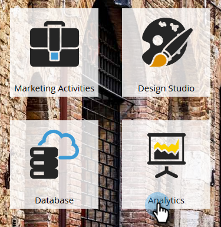

# Aprovar/cancelar aprovação de um modelo de receita {#approve-unapprove-a-revenue-model}

Você pode ter somente um modelo aprovado em um determinado momento.

>[!CAUTION]
>
>[Estágios individuais devem ser aprovados](/help/marketo/product-docs/reporting/revenue-cycle-analytics/revenue-cycle-models/approving-stages-and-assigning-leads-to-a-revenue-model.md) e pessoas adicionadas antes da aprovação de um modelo inteiro.

## Aprovar {#approve}

1. Vá para a área **[!UICONTROL Analytics]**.

   

1. Selecione um modelo na árvore.

   

1. No menu **[!UICONTROL Ações de Modelo]**, escolha **[!UICONTROL Aprovar Modelo]**.

   

1. Uma caixa de diálogo é exibida para confirmar sua escolha. Clique em **[!UICONTROL Aprovar]**.

   

Sua modelo agora está disponível.

## Cancelar aprovação {#unapprove}

>[!CAUTION]
>
>Se você cancelar a aprovação do modelo, todas as pessoas serão removidas do modelo e o histórico delas no modelo será excluído!

1. Vá para a área **[!UICONTROL Analytics]**.

   

1. Selecione um modelo na árvore.

   

1. Clique no menu **[!UICONTROL Ações de Modelo]** e escolha **[!UICONTROL Cancelar Aprovação do Modelo]**.

   

1. Na caixa de diálogo [!UICONTROL Cancelar aprovação do modelo] exibida, clique em **[!UICONTROL Cancelar aprovação]**.

   

Parabéns! Seu modelo não foi aprovado.

>[!CAUTION]
>
>Desaprovar um modelo remove todas as pessoas do modelo e remove seu histórico no modelo do banco de dados.
