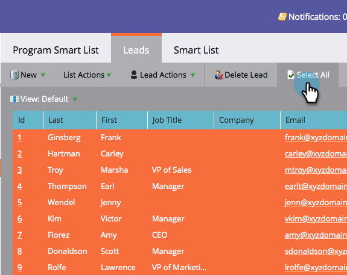

# Aprovação de estágios e atribuição de leads a um modelo de receita {#approving-stages-and-assigning-leads-to-a-revenue-model}

Obtenha seus **Modelo de receita** para funcionar e executar adicionando leads existentes, criando regras de atribuição para quaisquer novos leads.

## Aprovando estágios {#approving-stages}

Vamos aprovar as etapas do modelo antes de adicionar leads.

1. Vá para o **Analytics** área.

   

1. Selecione o modelo cujos estágios deseja aprovar.

   

1. Em **Ações do modelo**, selecione **Aprovar estágios**.

   

1. Você será recebido com um alerta. click **Atribuir leads**.

   

Excelente! Vamos continuar e atribuir esses leads.

## Atribuição de leads existentes {#assigning-existing-leads}

[Criar uma lista inteligente](/help/marketo/product-docs/core-marketo-concepts/smart-lists-and-static-lists/creating-a-smart-list/create-a-smart-list.md) para identificar os leads de um estágio do seu modelo no banco de dados de lead.

1. Uma vez que você tiver [criou a Smart List](/help/marketo/product-docs/core-marketo-concepts/smart-lists-and-static-lists/creating-a-smart-list/create-a-smart-list.md), clique no botão **Clientes potenciais** guia .

   

1. Clique em **Selecionar tudo** para selecionar os leads.

   

1. Abra o **Ações de lead** e selecione **Especial**. Clique em **Alterar Estágio de Receita**.

   

1. Selecione as opções corretas **Modelo** e as **Fase**. Clique em **Executar agora**.

   

1. Repita até que todos os leads sejam atribuídos aos vários estágios do modelo.

Ótimo! Para especificar como novos leads são atribuídos a palcos, crie regras de atribuição.

>[!NOTE]
>
>Se o modelo estiver no estado Estágios Aprovados, você não verá nenhum evento Alterar Estágio da Receita nos logs de atividade dos leads. Se o modelo estiver totalmente aprovado, essa etapa do fluxo será ignorada se você mover um lead para o mesmo estágio em que ele está no momento.

## Novos clientes potenciais: Criar Regras de Atribuição  {#new-leads-create-assignment-rules}

1. Clique em **Página inicial do Marketo** novamente e selecione **Analytics**.

   

1. Clique no modelo na árvore e, em seguida, na guia **Ações do modelo** , selecionando **Regras de atribuição**.

   

1. Se suas regras de atribuição contiverem mais de um clique de escolha padrão **Fase**, faça sua seleção e clique em **Adicionar escolha**.

   

## Exemplo de regra de atribuição {#example-assignment-rule}

Crie uma regra de Pontuação de lead para atribuir os novos leads com uma pontuação mínima a uma etapa apropriada.

1. Em **If**, selecione **Pontuação de lead**. Em seguida, escolha **pelo menos**.

   

1. Enter **40º** no campo e selecione **Líder de Vendas** como um Palco. Clique em **Salvar** para concluir.

   

>[!MORELIKETHIS]
>
>Para aprovar seu modelo, leia nossa página de ajuda em **[Aprovar e não aprovar um modelo de receita](/help/marketo/product-docs/reporting/revenue-cycle-analytics/revenue-cycle-models/approve-unapprove-a-revenue-model.md)**.
