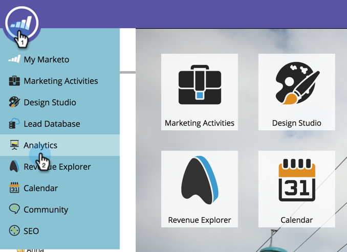
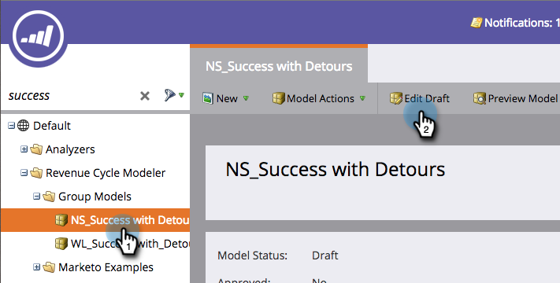

# Alteração do nome de um estágio {#changing-the-name-of-a-stage}

Mudar de ideia? Não é um problema. Renomear um estágio no modelador de ciclo de receita é fácil.

1. Vá para a área **[!UICONTROL Analytics]**.

   

1. Selecione um modelador de ciclo de receita a ser atualizado. Clique em **[!UICONTROL Editar rascunho]**.

   

1. Selecione o estágio que deseja atualizar e insira um novo **[!UICONTROL Nome]**.

   

1. Clique em **[!UICONTROL Fechar]**.

   

   Está vendo? Calma! Lembre-se de [Aprovar seu Modelo](/help/marketo/product-docs/reporting/revenue-cycle-analytics/revenue-cycle-models/approve-unapprove-a-revenue-model.md).
