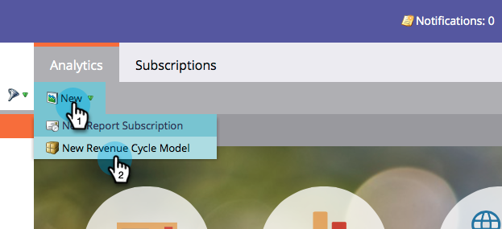

# Criar um novo modelo de receita {#create-a-new-revenue-model}

1. Para criar um novo Modelo de Ciclo de Receita, clique no botão **[!UICONTROL Analytics]** na tela inicial do [!UICONTROL My Marketo].

   

1. Na guia **[!UICONTROL Analytics]**, clique em **[!UICONTROL Novo]** e selecione **[!UICONTROL Novo modelo de ciclo de receita]**.

   

1. Uma janela modal **[!UICONTROL Novo Modelo de ciclo de receita]** é exibida. Insira um nome e clique em **[!UICONTROL Criar]**.

   

1. Clique em **[!UICONTROL Editar rascunho]** na exibição inicial do seu modelo.

   

1. Na nova janela, será apresentado um modelo com seis estágios de inventário, cinco transições entre esses estágios e a capacidade de adicionar estágios de inventário, SLA e portal.

   

Aparentemente nítido! Você acabou de entrar no maravilhoso mundo da modelagem.

>[!MORELIKETHIS]
>
>Saiba mais sobre [Utilização dos estágios de inventário de modelo de receita](/help/marketo/product-docs/reporting/revenue-cycle-analytics/revenue-cycle-models/using-revenue-model-inventory-stages.md).
