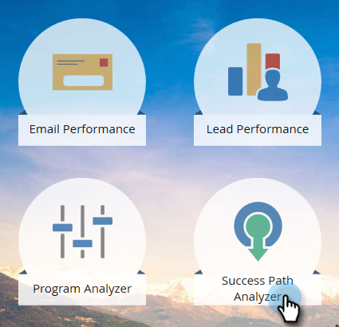

# Criar um Analisador de caminho de sucesso {#create-a-success-path-analyzer}

Obtenha uma representação visual da velocidade e do fluxo em seu modelo de ciclo de receita.

>[!PREREQUISITES]
>
>[Criar um novo modelo de receita](/help/marketo/product-docs/reporting/revenue-cycle-analytics/revenue-cycle-models/create-a-new-revenue-model.md)

1. Clique em **Analytics** bloco.

   

1. Clique em **Analisador de caminho de sucesso** ícone.

   

   >[!NOTE]
   >
   >Se você receber um aviso de que nenhum dado foi encontrado no intervalo de tempo especificado, basta clicar em **Fechar** para alterar o intervalo de tempo. Se você não for solicitado, mas quiser alterar o intervalo de tempo, acesse **Configuração** e clique duas vezes em **Intervalo de tempo**.

1. Se você não tiver dados ou estiver alterando o intervalo de tempo, selecione um na lista suspensa e clique em Salvar.

   

   >[!TIP]
   >
   >Para selecionar um intervalo específico, selecione **Personalizado** e use o **De** e **Para** campos.

1. Se você tiver mais de um Modelo de ciclo de receita, selecione aquele que você deseja na lista **Configuração** guia.

   

1. Escolha o modelo apropriado e clique em **Aplicar**.

   

1. Clique em **Analisador de caminho de sucesso** guia.

   

Agora você pode explorar o movimento de cada estágio para o próximo!

>[!TIP]
>
>Quer salvar seu relatório? Clique em **Ações do analisador** e selecione **Salvar como**.

>[!MORELIKETHIS]
>
>[Uso do Analisador de caminho de sucesso](/help/marketo/product-docs/reporting/revenue-cycle-analytics/revenue-cycle-models/using-the-success-path-analyzer.md)
