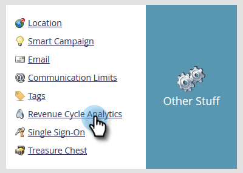

# Habilitar grupos de campos personalizados para análise de desempenho do modelo (leads) {#enable-custom-field-groups-for-model-performance-analysis-leads}

>[!PREREQUISITES]
>
>Categorizar campos padrão ou personalizados em grupos para relatórios por meio do Organizador de campos no Marketo. Para obter detalhes, consulte [Criar grupos de campos personalizados por meio do Organizador de Campos](/help/marketo/product-docs/reporting/revenue-cycle-analytics/revenue-tools/field-organizers/create-custom-field-groups-using-the-field-organizer.md).

<table>
 <tbody>
  <tr>
   <td colspan="3" rowspan="1">
<strong>Como a ativação de um grupo de campos personalizados afeta várias áreas de análise no Gerenciador de ciclo de receita?</strong>
</td>
  </tr>
  <tr>
   <td colspan="1" rowspan="1">
<strong>O que acontece quando...?</strong>
</td>
   <td colspan="1" rowspan="1">
<strong>Como isso afeta a área Análise de Desempenho de Modelo (clientes potenciais)</strong>
</td>
   <td colspan="1" rowspan="1">
<strong>Como isso afeta as áreas de análise de clientes potenciais, análise de campanha e análise de oportunidades</strong>
</td>
  </tr>
  <tr>
   <td colspan="1" rowspan="1">
<strong>O que acontece quando você habilita um grupo de campos personalizado associado a um cliente potencial ou campo de empresa padrão?</strong>
</td>
   <td colspan="1" rowspan="1">
O grupo de campos personalizados está habilitado para relatórios na área Análise de Desempenho de Modelo (Clientes Potenciais)
</td>
   <td colspan="1" rowspan="1">
Sem impacto
</td>
  </tr>
  <tr>
   <td colspan="1" rowspan="1">
<strong>O que acontece quando você habilita um grupo de campos personalizado associado a um campo de pessoa ou empresa personalizado?</strong>
</td>
   <td colspan="1" rowspan="1">
O grupo de campos personalizados está habilitado para relatórios na área Análise de Desempenho de Modelo (Clientes Potenciais)
</td>
   <td colspan="1" rowspan="1">
O próprio campo personalizado é ativado para relatórios nas áreas Análise de lead, Análise de campanha e Análise de oportunidade.

<strong>OBSERVAÇÃO:</strong> os grupos de campos personalizados NÃO são suportados nessas áreas de análise, portanto, as associações de grupo não são exibidas no Gerenciador de Ciclo de Receita—<em>somente</em> o campo personalizado.
</td>
  </tr>
 </tbody>
</table>

Siga estas etapas para habilitar um grupo de campos personalizado para relatórios na área [!UICONTROL Análise de Desempenho de Modelo (Clientes Potenciais)].

1. Clique em **[!UICONTROL Administrador]**.

   

1. Clique em **[!UICONTROL Análise do ciclo de receita]**.

   

1. Clique em **[!UICONTROL Nenhum]** ao lado de um grupo de campos vazio. Se você já tiver três grupos de campos ativados e quiser fazer uma edição, clique no nome do grupo de campos que deseja modificar.

   

1. Clique na lista suspensa **[!UICONTROL Campo]** e selecione o que deseja.

   

   >[!NOTE]
   >
   >Este exemplo habilitou um grupo de campos personalizados para um campo padrão (Estado). Portanto, somente a Área [!UICONTROL Análise de Desempenho de Modelo (Clientes Potenciais)] foi afetada. Se um grupo de campos personalizado para um campo de pessoa ou empresa personalizado tivesse sido habilitado, o grupo habilitado seria exibido na seção [!UICONTROL Análise de Desempenho de Modelo (Clientes Potenciais)] da guia Resumo da Sincronização, e a contagem de campos personalizados para Cliente Potencial, Campanha e Análise de Oportunidade aumentaria em um.

1. Clique em **[!UICONTROL Salvar]**.

   
