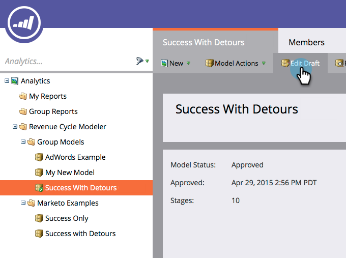

# Mesclar dois estágios no modelador de receita {#merging-two-stages-in-the-revenue-modeler}

Após aprovar o modelo, não é possível excluir estágios ao editar um rascunho. Em vez disso, você pode mesclar esse estágio com outro.

1. Clique em **Marketo Home** e selecione **[!UICONTROL Analytics]**.

   

1. Clique no modelo aprovado.

   

1. Clique em **[!UICONTROL Editar rascunho.]**

   

1. Clique com o botão direito do mouse no estágio que deseja mesclar e selecione **[!UICONTROL Mesclar] Estágio** no menu.

   

1. Clique no estágio específico na lista suspensa.

   

1. Você pode aprovar novamente o modelo selecionando **[!UICONTROL Aprovar rascunho do modelo]** no menu **[!UICONTROL Ações do modelo]**.

   

>[!NOTE]
>
>Escolha **[!UICONTROL Nenhum]** no menu suspenso [!UICONTROL Estágio de mesclagem] para remover os clientes em potencial do seu modelo
