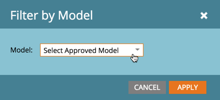

# Relatório sobre o modelo de receita {#report-on-your-revenue-model}

Para cada modelo de ciclo de receita, é possível gerar um relatório sobre quantos leads estão em cada estágio.

>[!NOTE]
>
>Os clientes em potencial devem ser membros do modelo a ser incluído no relatório.

1. Vá para **[!UICONTROL Analytics]**.

   

1. Clique em **[!UICONTROL Clientes potenciais por estágio de receita]**.

   

1. Clique na guia **[!UICONTROL Configuração]** e, abaixo da seção de filtro, clique duas vezes em **[!UICONTROL Modelo de Ciclo de Receita]**.

   

1. Selecione o **[!UICONTROL Modelo]** aprovado.

   

   >[!NOTE]
   >
   >Para estar disponível nesse menu suspenso, o modelo deve ser aprovado ou ter pelo menos estágios aprovados.

1. Clique na guia **[!UICONTROL Relatório]** para ver quantos clientes em potencial estão em cada estágio do seu modelo de ciclo de receita.

   

Por que isso é útil? O modelo mostra sua funnel de vendas e marketing. Acompanhe seus saldos ao longo do tempo para identificar gargalos antes que eles se tornem um problema.
