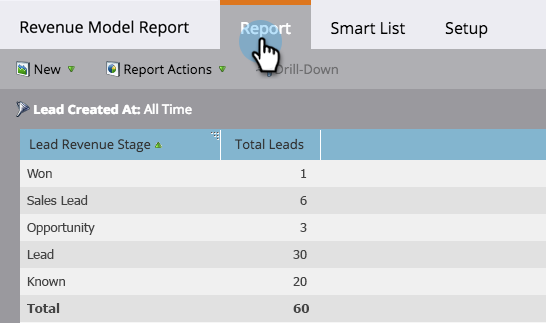

# Relatório sobre seu modelo de receita {#report-on-your-revenue-model}

Para cada modelo de ciclo de receita, você pode gerar um relatório sobre quantos clientes potenciais estão em cada estágio.

>[!NOTE]
>
>Os clientes potenciais devem ser membros do modelo a ser incluído no relatório.

1. Vá para **Analytics**.

   

1. Clique em **Clientes potenciais por estágio** de receita.

   

1. Clique na guia **Configuração** e, abaixo da seção de filtro, clique em duplo-clique em Modelo **de ciclo de** receita.

   

1. Selecione o **Modelo** aprovado.

   

   >[!NOTE]
   >
   >Para estar disponível nesse menu suspenso, o modelo deve ser aprovado ou, pelo menos, ter etapas aprovadas.

1. Clique na guia **Relatório** para ver quantos clientes em potencial estão em cada estágio do seu modelo de ciclo de receita.

   

Por que isso é útil? O modelo mostra seu funil de vendas e marketing. Acompanhe seus saldos ao longo do tempo para identificar gargalos antes que eles se tornem um problema.
