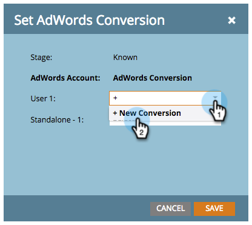
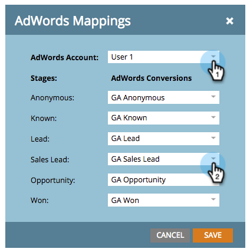

# Definir conversões do Google AdWords no modelo de receita com uma conta de gerente {#set-google-adwords-conversions-in-the-revenue-model-with-a-manager-account}

Vincule sua conta do Google AdWords ao Marketo para fazer upload automático dos dados de conversão offline do Marketo para o Google AdWords. Em seguida, na interface do usuário do AdWords, você poderá ver facilmente quais cliques resultaram em leads qualificados, oportunidades e novos clientes (ou em quaisquer estágios de receita que deseja rastrear) após [adicionar colunas personalizadas](https://support.google.com/adwords/answer/3073556) no AdWords.

Se você tiver várias contas Google AdWords, poderá usar um [Conta do gerente do Google AdWords](https://www.google.com/adwords/manager-accounts/) (anteriormente conhecido como Meu centro do cliente) para integrá-los ao Marketo.

Você pode mapear conversões offline do AdWords para um ou mais estágios em um modelo de Receita. Há duas maneiras:

* Ação de preparo
* Mapeamento do AdWords

>[!PREREQUISITES]
>
>[Adicionar o Google AdWords como um serviço do Launchpoint com uma conta do gerente](/help/marketo/product-docs/administration/additional-integrations/add-google-adwords-as-a-launchpoint-service-with-a-manager-account.md)

## Usar Ação de Estágio {#use-stage-action}

Mapeie uma conversão do AdWords em Ações de estágio.

1. Selecione a etapa que deseja mapear para uma conversão do AdWords.

   

1. Em **Ações de preparo** , selecione **Definir conversão do AdWords**.

   

1. Defina um **Conversão do AdWords**.

   >[!NOTE]
   >
   >Uma conversão diferente do AdWords pode ser selecionada para cada conta-filho.

   

   Dica: Se você não tiver conversões do AdWords, crie uma clicando em **+Nova conversão**.

   

1. Clique em **Salvar**.

   

1. Quando terminar de mapear todas as conversões do AdWords para estágios de receita, volte para a página de resumo. Selecionar **Ações do modelo** e escolha **Aprovar estágios**.

   

## Dica do profissional: Adicionar uma nova conversão {#pro-tip-add-a-new-conversion}

Dica do Pro! Uma nova conversão offline do AdWords pode ser criada no Marketo.

>[!CAUTION]
>
>Novas conversões criadas no Marketo têm a configuração de &quot;otimização&quot; ativada. Isso significa que as estratégias de lances do AdWords podem otimizar seus lances para essas conversões. Você pode alterar essa configuração da sua conta do AdWords.

1. Em **Ações de preparo** , selecione **Definir conversão do AdWords**.

   

1. Selecionar **Nova conversão**.

   

1. Insira um **Nome da conversão**. Clique em **Salvar**.

   

   Excelente! Essa nova conversão aparecerá em sua conta do AdWords.

## Usar o mapeamento do AdWords {#use-adwords-mapping}

Você pode associar todos os estágios do modelo à Conversão do AdWords em um único local usando Mapeamentos do AdWords.

1. Selecionar **Editar mapeamentos do AdWords**.

   

1. Selecione o **Conta do AdWords** e desejado **Conversão do AdWords** para cada estágio que você deseja rastrear.

   

1. Depois de mapear seus estágios, clique em **Salvar**.

   

1. Quando terminar de mapear todas as conversões do AdWords para estágios de receita, volte para a página de resumo. Selecionar **Ações do modelo** e escolha **Aprovar estágios**.

   

Para visualizar os dados de conversão offline, você precisará fazer logon na conta do AdWords. Recomendamos que você use os [Recurso Colunas personalizadas](https://support.google.com/adwords/answer/3073556) para criar colunas de contagem de conversão para cada conversão offline importada do Marketo.
