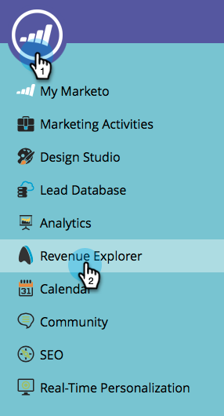
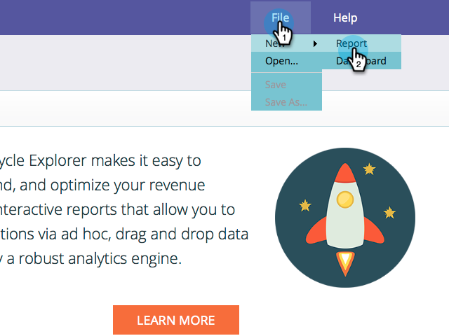

# Começar a rastrear por conta na Modeler de receita {#start-tracking-by-account-in-the-revenue-modeler}

Com o Modeler de Preparo de Receita e o [!UICONTROL Explorador de Receita], você obtém o insight sobre o desempenho de seus clientes potenciais e contas à medida que avançam pelo seu modelo.

>[!NOTE]
>
>Verifique se o modelo aprovado tem estágios no caminho de sucesso com a opção **Iniciar rastreamento por conta** marcada

1. Depois de um tempo suficiente para coletar dados úteis, selecione **[!UICONTROL Explorador de Receita]** na **Página Inicial da Minha Marketo**.

   

1. Para criar um novo relatório, clique em **[!UICONTROL Arquivo]** e selecione **[!UICONTROL Novo]** e depois **[!UICONTROL Relatório]**.

   

1. Selecione **[!UICONTROL Análise de Desempenho de Modelo (Empresas)]** como a área de análise e clique em **[!UICONTROL OK]**.

   

1. Recomendamos que você arraste os campos **[!UICONTROL Estágio]**, **[!UICONTROL Mês]** e **[!UICONTROL Saldo Final]** para mostrar a progressão das empresas em seu modelo por mês. Use filtros para selecionar os meses desejados.

   

1. Quando você terminar de configurar o seu relatório, clique com o botão direito do mouse em **[!UICONTROL É a Empresa de Rastreamento]** e selecione **[!UICONTROL Filtro]**. Usaremos isso para limitar o relatório a apenas estágios em que **Rastreamento por Conta** esteja selecionado.

   

1. Na caixa de diálogo exibida, selecione **[!UICONTROL Sim]** e clique na seta à direita no meio. Isso filtrará somente esses estágios com &quot;Rastreamento por conta&quot; ativado. Clique em **[!UICONTROL OK]** quando terminar.

   

1. Seu relatório agora deve mostrar apenas os estágios que você está rastreando por conta. Salve o relatório para usá-lo no futuro. Agora você pode usar isso como outra medida do sucesso de seus esforços de marketing.
